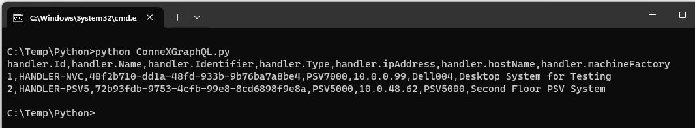

# ConneXGraphQL Script

The ConneXGraphQL script is an example of how to implement a simple GraphQL client to run queries with ConneX using Python. The script requires the [gql](https://pypi.org/project/gql/) (GraphQL client for Python) library installed in our environment. 

The script can perform several queries and outputs the results to the console. In the following sections there are descriptions of the script functionality.

## Initialization

The GraphQL client is initialized using a HTTP transport to the URL of the target ConneX GraphQL server. In the example code we use `localhost` as default assuming the script is goint to be run in the same machine where the ConneX Server is installed, but this can be changed.

```python
# Initialize HTTP transport with ConneX GraphQL server in localhost.
# Replace 'localhost' with the IP address of the ConneX Server machine if
# the server is running in a different machine.
transport = RequestsHTTPTransport(url="http://localhost:5001/graphql")

# Initialize the GraphQL client, fetch the schema to validate queries
client = Client(transport=transport, fetch_schema_from_transport=True)
```

## Query Function

A query function is defined to outline the common steps required to execute a GraphQL query and get the parsed response. The response is returned in the form of a Dictionary.

```python
# Issue GraphQL query to ConneX server and wait for a response
def connex_gql_query(request_string):
    # print(request_string)
    query = gql(request_string)
    result = client.execute(query, parse_result=True)    
    # print(result)
    return result
```

Two print statements can be uncommented in case we want to see how the request string and result look like.

There are several queries implemented in this script, each defined in its own function:

1. [Query for all handlers in the system](#query-for-all-handlers-in-the-system)
1. [Query for all programmers in the system](#query-for-all-programmers-in-the-system)
1. [Query for all adapters in the system](#query-for-all-adapters-in-the-system)
1. [Query for latest statistics of all adapters in the system](#query-for-latest-statistics-of-all-adapters-in-the-system)
1. [Query all MQTT messages with topic "programmingcomplete"](#query-all-mqtt-messages-with-topic-programmingcomplete)
1. [Query all MQTT messages in the database](#query-all-mqtt-messages-in-the-database)

## Query for all handlers in the system

This function executes the following query:

```graphql
query { 
    systems {
        handlerId
        entity{
          entityIdentifier
          entityName
        }
        handlerType
        ipAddress
        hostName
        machineFactory
    }
}
```

The output is a list of all the handlers in the ConneX system, in the form of comma separated values, similar to the following:

```
handler.Id,handler.Name,handler.Identifier,handler.Type,handler.ipAddress,handler.hostName,handler.machineFactory
1,HANDLER-NVC,40f2b710-dd1a-48fd-933b-9b76ba7a8be4,PSV7000,10.0.0.99,Dell004,Desktop System for Testing
2,HANDLER-PSV5,72b93fdb-9753-4cfb-99e8-8cd6898f9e8a,PSV5000,10.0.48.62,PSV5000,Second Floor PSV System
```

## Query for all programmers in the system

This function executes the following query:

```graphql
query { 
    programmers {
        programmerId  
        entity {
            entityName
            entityIdentifier
        }
        programmerType
        ipAddress
        handler {
            entity {
                entityName                
            }
        }
    }
}
```

The output is a list of all the programmers in the ConneX system, in the form of comma separated values, similar to the following:

```
programmer.Id,programmer.Name,programmer.Identifier,programmer.Type,programmer.ipAddress,handler.Name
1,NVC-LX10,001-035-136-002-092-054-021-006-238,LUMEN_X,10.0.0.10,HANDLER-NVC
2,NVC-LX11,001-035-032-021-008-253-056-185-238,LUMEN_X,10.0.0.11,HANDLER-NVC
3,PSV5-LX05,001-035-012-249-202-199-172-046-238,LUMEN_X,10.0.0.5,HANDLER-PSV5
4,PSV5-LX06,001-035-136-148-137-224-207-100-238,LUMEN_X,10.0.0.6,HANDLER-PSV5
5,PSV5-FC02,0010EC81E224,FLASH_CORE,192.168.1.2,HANDLER-PSV5
```

## Query for all adapters in the system

This function executes the following query:

```graphql
query { 
    adapters {
        adapterKey
        adapterId
        entity{
            entityIdentifier
        }
        programmer{
            entity {
                entityName
            }
        }
    }
}
```

The output is a list of all the adapters in the ConneX system, in the form of comma separated values, similar to the following:

```
adapter.Id,adapter.Identifier,adapter.Type,programmer.Name
1,001-035-084-126-024-126-008-211-238,110008,NVC-LX10
2,001-035-047-173-024-126-008-211-238,110008,NVC-LX10
3,001-035-216-109-026-059-090-196-238,110008,NVC-LX11
4,001-035-050-069-024-126-008-211-238,110008,NVC-LX11
```

## Query for latest statistics of all adapters in the system

This function executes several queries.

One query to get a list of all the available adapters in the ConneX system:

```graphql
query { 
    adapters {
        entity{
            entityIdentifier
        }
    }
}
```

This list of adapters will be used to issue queries similar to the one below, to get the latest statistics reported in the system for each adapter:

```graphql
query {
    latestAdapterStatistics(
        entityIdentifier: "001-035-084-126-024-126-008-211-238"
    )
    {
        adapterId
        cleanCount
        lifetimeActuationCount
        lifetimeContinuityFailCount
        lifetimeFailCount
        lifetimePassCount
        socketIndex
        adapterState
    }
}
```

The final output is a list of the statistics for all adapters in the ConneX system, in the form of comma separated values, similar to the following:

```
adapter.Identifier,adapter.Type,cleanCount,lifetimeActuationCount,lifetimeContinuityFailCount,lifetimeFailCount,lifetimePassCount,socketIndex,adapterState
001-035-084-126-024-126-008-211-238,110008,8528,8538,0,2,8526,1,VALIDATED
001-035-047-173-024-126-008-211-238
001-035-216-109-026-059-090-196-238,110008,99826,99826,0,0,99826,2,VALIDATED
001-035-050-069-024-126-008-211-238
```

The rows with no statistics information belong to adapters that have not been used in the system yet.

## Query all MQTT messages with topic "programmingcomplete"

This function executes several queries to get from the ConneX Server database all the MQTT messages with topic containing "programmingcomplete".
The first query is like this:

```graphql
query {
    messages (take:50 skip:0
        where: {
            topic: {
                contains: "programmingcomplete"
            }
        } ) {
        totalCount
        items {
            topic
            timestamp
            payloadAsString
        }
        pageInfo {
            hasNextPage
        }
    }
}
```

In the response we get the total count (`totalCount`) of MQTT messages that matched the search criteria, and page information (`hasNextPage`) that will allow us to implement a loop to get all the messages.

The final output of the function is a list of all the messages. The first row indicates how many messages were found.

```
Total "programmingcomplete" messages found: 65
2023-11-30T22:19:38.828-08:00 | connex/programmer/lumenx/legacy/programmingcomplete | [{"TimeStamp":"2023-11-30T14:19:35.7757543Z","Programmer":{"Class":"LumenX","FirmwareVersion":"2.1.1.44","SerialNumber":"001-035-136-002-092-054-021-006-238","SystemVersion":"2.1.1.44","ProgrammerIP":"10.0.0.10","Adapter":{"AdapterId":"110008","AdapterSerialNumber":"001-035-084-126-024-126-008-211-238","CleanCount":"8496","LifetimeActuationCount":"8506","LifetimeContinuityFailCount":"0","LifetimeFailCount":"2","LifetimePassCount":"8494","SocketIndex":"1","AdapterState":"Validated"}},"Job":{"AlgorithmId":"27415240116273152","JobId":"3df1074a-471e-4f9e-8892-bf8d768f17ef","JobName":"Verify Memory (2GB)","JobDescription":"Memory verification job, it does not program, it only performs memory verification.","DeviceName":"KLMDG4UCTA-B041","DeviceManufacturer":"Samsung","DeviceType":"Emmc","DeviceID":"24934","AlgoVersion":"9.4.0"},"PartDetail":{"ChipId":"","RawChipId":"","Result":{"Code":"0","CodeName":"Success","ProgramDuration":0,"VerifyDuration":24300,"Times":null,"AlgoDeviceDetails":{"CID":"CID(127-0):15-01-00-44-55-54-41-34-32-02-D9-D3-B6-39-95-55","device":null,"sentrix":null,"Cnt":"2","eCSD":"eCSD(0-511):00-00-00-00-00-00-00-00-00-00-00-00-00-00-00-00-39-00-00-00-00-00-00-00-00-00-00-00-00-00-00-00-00-00-01-00-00-00-00-00-00-00-00-00-00-00-00-00-00-00-00-00-00-00-00-00-00-00-00-00-00-00-00-00-0F-00-00-C8-C8-C8-80-05-05-00-01-00-00-00-00-00-00-00-00-00-00-00-00-00-00-00-00-00-00-00-00-00-00-00-00-00-00-05-00-00-00-00-00-00-00-00-53-03-00-00-00-00-00-00-00-00-00-00-00-00-00-00-00-00-00-00-01-00-00-00-00-00-00-00-00-00-00-00-00-00-00-00-00-00-00-00-00-00-00-00-00-00-00-69-13-00-07-00-00-00-00-00-14-1F-80-00-00-00-00-00-00-00-00-00-00-00-00-00-00-00-01-01-00-00-00-00-00-00-08-00-02-00-57-1F-0A-02-00-00-00-00-00-00-00-00-00-00-00-01-00-60-8F-0E-07-11-00-07-07-10-01-01-01-07-20-00-07-11-1B-55-02-00-00-00-00-00-00-00-00-1E-00-00-00-00-00-3C-0A-00-00-01-00-00-02-00-00-00-00-00-00-00-00-00-01-60-00-01-01-01-00-00-00-00-00-00-00-00-00-00-00-00-00-00-00-00-00-00-00-00-00-00-00-00-00-00-00-00-00-00-00-00-00-00-00-00-00-0F-01-00-00-00-00-00-00-00-00-00-00-00-00-00-00-00-00-00-00-00-00-00-00-00-00-00-00-00-00-00-00-00-00-00-00-00-00-00-00-00-00-00-00-00-00-00-00-00-00-00-00-00-00-00-00-00-00-00-00-00-00-00-00-00-00-00-00-00-00-00-00-00-00-00-00-00-00-00-00-00-00-00-00-00-00-00-00-00-00-00-00-00-00-00-00-00-00-00-00-00-00-00-00-00-00-00-00-00-00-00-00-00-00-00-00-00-00-00-00-00-00-00-00-00-00-00-00-00-00-00-00-00-00-00-00-00-00-00-00-00-00-00-00-00-00-00-00-00-00-00-00-00-00-00-00-00-00-00-00-00-00-00-00-00-00-00-00-00-00-00-00-00-00-00-00-00-00-00-00-00-00-81-C7-00-00-03-03-07-05-00-02-01-3F-3F-01-01-01-00-00-00-00-00-00-00"},"BlankCheckDuration":"0","EraseDuration":"0","ErrorMessage":"","BytesProgrammed":0,"SocketIndex":"1","Overhead":"2500"}},"HandlerInfo":{"Name":"Dell004","IpAddresses":"192.168.56.1,10.0.0.99,10.0.51.167","Version":"3.0.7.48","MachineSNID":"PSV7000:xxxxxxx","MachineName":"HANDLER-NVC","FactoryName":"Desktop System for Testing","LicenseLevel":null,"PCSerialNumber":"1CXM7V3"},"SerialData":null}]
2023-11-30T22:19:39.247-08:00 | connex/programmer/lumenx/legacy/programmingcomplete | [{"TimeStamp":"2023-11-30T14:19:36.0610288Z","Programmer":{"Class":"LumenX","FirmwareVersion":"2.1.1.44","SerialNumber":"001-035-032-021-008-253-056-185-238","SystemVersion":"2.1.1.44","ProgrammerIP":"10.0.0.11","Adapter":{"AdapterId":"110008","AdapterSerialNumber":"001-035-216-109-026-059-090-196-238","CleanCount":"99795","LifetimeActuationCount":"99795","LifetimeContinuityFailCount":"0","LifetimeFailCount":"0","LifetimePassCount":"99795","SocketIndex":"2","AdapterState":"Validated"}},"Job":{"AlgorithmId":"27415240116273152","JobId":"3df1074a-471e-4f9e-8892-bf8d768f17ef","JobName":"Verify Memory (2GB)","JobDescription":"Memory verification job, it does not program, it only performs memory verification.","DeviceName":"KLMDG4UCTA-B041","DeviceManufacturer":"Samsung","DeviceType":"Emmc","DeviceID":"24934","AlgoVersion":"9.4.0"},"PartDetail":{"ChipId":"","RawChipId":"","Result":{"Code":"0","CodeName":"Success","ProgramDuration":0,"VerifyDuration":24300,"Times":null,"AlgoDeviceDetails":{"CID":"CID(127-0):15-01-00-44-55-54-41-34-32-02-D9-D3-B6-38-95-43","device":null,"sentrix":null,"Cnt":"2","eCSD":"eCSD(0-511):00-00-00-00-00-00-00-00-00-00-00-00-00-00-00-00-39-00-00-00-00-00-00-00-00-00-00-00-00-00-00-00-00-00-01-00-00-00-00-00-00-00-00-00-00-00-00-00-00-00-00-00-00-00-00-00-00-00-00-00-00-00-00-00-0F-00-00-C8-C8-C8-80-05-05-00-01-00-00-00-00-00-00-00-00-00-00-00-00-00-00-00-00-00-00-00-00-00-00-00-00-00-00-05-00-00-00-00-00-00-00-00-55-03-00-00-00-00-00-00-00-00-00-00-00-00-00-00-00-00-00-00-01-00-00-00-00-00-00-00-00-00-00-00-00-00-00-00-00-00-00-00-00-00-00-00-00-00-00-69-13-00-07-00-00-00-00-00-14-1F-80-00-00-00-00-00-00-00-00-00-00-00-00-00-00-00-01-01-00-00-00-00-00-00-08-00-02-00-57-1F-0A-02-00-00-00-00-00-00-00-00-00-00-00-01-00-60-8F-0E-07-11-00-07-07-10-01-01-01-07-20-00-07-11-1B-55-02-00-00-00-00-00-00-00-00-1E-00-00-00-00-00-3C-0A-00-00-01-00-00-02-00-00-00-00-00-00-00-00-00-01-60-00-01-01-01-00-00-00-00-00-00-00-00-00-00-00-00-00-00-00-00-00-00-00-00-00-00-00-00-00-00-00-00-00-00-00-00-00-00-00-00-00-0F-01-00-00-00-00-00-00-00-00-00-00-00-00-00-00-00-00-00-00-00-00-00-00-00-00-00-00-00-00-00-00-00-00-00-00-00-00-00-00-00-00-00-00-00-00-00-00-00-00-00-00-00-00-00-00-00-00-00-00-00-00-00-00-00-00-00-00-00-00-00-00-00-00-00-00-00-00-00-00-00-00-00-00-00-00-00-00-00-00-00-00-00-00-00-00-00-00-00-00-00-00-00-00-00-00-00-00-00-00-00-00-00-00-00-00-00-00-00-00-00-00-00-00-00-00-00-00-00-00-00-00-00-00-00-00-00-00-00-00-00-00-00-00-00-00-00-00-00-00-00-00-00-00-00-00-00-00-00-00-00-00-00-00-00-00-00-00-00-00-00-00-00-00-00-00-00-00-00-00-00-00-81-C7-00-00-03-03-07-05-00-02-01-3F-3F-01-01-01-00-00-00-00-00-00-00"},"BlankCheckDuration":"0","EraseDuration":"0","ErrorMessage":"","BytesProgrammed":0,"SocketIndex":"2","Overhead":"2900"}},"HandlerInfo":{"Name":"Dell004","IpAddresses":"192.168.56.1,10.0.0.99,10.0.51.167","Version":"3.0.7.48","MachineSNID":"PSV7000:xxxxxxx","MachineName":"HANDLER-NVC","FactoryName":"Desktop System for Testing","LicenseLevel":null,"PCSerialNumber":"1CXM7V3"},"SerialData":null}]
2023-11-30T22:20:05.512-08:00 | connex/programmer/lumenx/legacy/programmingcomplete | [{"TimeStamp":"2023-11-30T14:20:04.095884Z","Programmer":{"Class":"LumenX","FirmwareVersion":"2.1.1.44","SerialNumber":"001-035-136-002-092-054-021-006-238","SystemVersion":"2.1.1.44","ProgrammerIP":"10.0.0.10","Adapter":{"AdapterId":"110008","AdapterSerialNumber":"001-035-084-126-024-126-008-211-238","CleanCount":"8497","LifetimeActuationCount":"8507","LifetimeContinuityFailCount":"0","LifetimeFailCount":"2","LifetimePassCount":"8495","SocketIndex":"1","AdapterState":"Validated"}},"Job":{"AlgorithmId":"27415240116273152","JobId":"3df1074a-471e-4f9e-8892-bf8d768f17ef","JobName":"Verify Memory (2GB)","JobDescription":"Memory verification job, it does not program, it only performs memory verification.","DeviceName":"KLMDG4UCTA-B041","DeviceManufacturer":"Samsung","DeviceType":"Emmc","DeviceID":"24934","AlgoVersion":"9.4.0"},"PartDetail":{"ChipId":"","RawChipId":"","Result":{"Code":"0","CodeName":"Success","ProgramDuration":0,"VerifyDuration":24200,"Times":null,"AlgoDeviceDetails":{"CID":"CID(127-0):15-01-00-44-55-54-41-34-32-02-D9-D3-B6-39-95-55","device":null,"sentrix":null,"Cnt":"2","eCSD":"eCSD(0-511):00-00-00-00-00-00-00-00-00-00-00-00-00-00-00-00-39-00-00-00-00-00-00-00-00-00-00-00-00-00-00-00-00-00-01-00-00-00-00-00-00-00-00-00-00-00-00-00-00-00-00-00-00-00-00-00-00-00-00-00-00-00-00-00-0F-00-00-C8-C8-C8-80-05-05-00-01-00-00-00-00-00-00-00-00-00-00-00-00-00-00-00-00-00-00-00-00-00-00-00-00-00-00-05-00-00-00-00-00-00-00-00-53-03-00-00-00-00-00-00-00-00-00-00-00-00-00-00-00-00-00-00-01-00-00-00-00-00-00-00-00-00-00-00-00-00-00-00-00-00-00-00-00-00-00-00-00-00-00-69-13-00-07-00-00-00-00-00-14-1F-80-00-00-00-00-00-00-00-00-00-00-00-00-00-00-00-01-01-00-00-00-00-00-00-08-00-02-00-57-1F-0A-02-00-00-00-00-00-00-00-00-00-00-00-01-00-60-8F-0E-07-11-00-07-07-10-01-01-01-07-20-00-07-11-1B-55-02-00-00-00-00-00-00-00-00-1E-00-00-00-00-00-3C-0A-00-00-01-00-00-02-00-00-00-00-00-00-00-00-00-01-60-00-01-01-01-00-00-00-00-00-00-00-00-00-00-00-00-00-00-00-00-00-00-00-00-00-00-00-00-00-00-00-00-00-00-00-00-00-00-00-00-00-0F-01-00-00-00-00-00-00-00-00-00-00-00-00-00-00-00-00-00-00-00-00-00-00-00-00-00-00-00-00-00-00-00-00-00-00-00-00-00-00-00-00-00-00-00-00-00-00-00-00-00-00-00-00-00-00-00-00-00-00-00-00-00-00-00-00-00-00-00-00-00-00-00-00-00-00-00-00-00-00-00-00-00-00-00-00-00-00-00-00-00-00-00-00-00-00-00-00-00-00-00-00-00-00-00-00-00-00-00-00-00-00-00-00-00-00-00-00-00-00-00-00-00-00-00-00-00-00-00-00-00-00-00-00-00-00-00-00-00-00-00-00-00-00-00-00-00-00-00-00-00-00-00-00-00-00-00-00-00-00-00-00-00-00-00-00-00-00-00-00-00-00-00-00-00-00-00-00-00-00-00-00-81-C7-00-00-03-03-07-05-00-02-01-3F-3F-01-01-01-00-00-00-00-00-00-00"},"BlankCheckDuration":"0","EraseDuration":"0","ErrorMessage":"","BytesProgrammed":0,"SocketIndex":"1","Overhead":"2000"}},"HandlerInfo":{"Name":"Dell004","IpAddresses":"192.168.56.1,10.0.0.99,10.0.51.167","Version":"3.0.7.48","MachineSNID":"PSV7000:xxxxxxx","MachineName":"HANDLER-NVC","FactoryName":"Desktop System for Testing","LicenseLevel":null,"PCSerialNumber":"1CXM7V3"},"SerialData":null}]
.
.
.
2023-11-30T22:35:09.414-08:00 | connex/programmer/lumenx/legacy/programmingcomplete | [{"TimeStamp":"2023-11-30T14:35:08.186607Z","Programmer":{"Class":"LumenX","FirmwareVersion":"2.1.1.44","SerialNumber":"001-035-136-002-092-054-021-006-238","SystemVersion":"2.1.1.44","ProgrammerIP":"10.0.0.10","Adapter":{"AdapterId":"110008","AdapterSerialNumber":"001-035-084-126-024-126-008-211-238","CleanCount":"8528","LifetimeActuationCount":"8538","LifetimeContinuityFailCount":"0","LifetimeFailCount":"2","LifetimePassCount":"8526","SocketIndex":"1","AdapterState":"Validated"}},"Job":{"AlgorithmId":"27415240116273152","JobId":"3df1074a-471e-4f9e-8892-bf8d768f17ef","JobName":"Verify Memory (2GB)","JobDescription":"Memory verification job, it does not program, it only performs memory verification.","DeviceName":"KLMDG4UCTA-B041","DeviceManufacturer":"Samsung","DeviceType":"Emmc","DeviceID":"24934","AlgoVersion":"9.4.0"},"PartDetail":{"ChipId":"","RawChipId":"","Result":{"Code":"0","CodeName":"Success","ProgramDuration":0,"VerifyDuration":24200,"Times":null,"AlgoDeviceDetails":{"CID":"CID(127-0):15-01-00-44-55-54-41-34-32-02-D9-D3-B6-39-95-55","device":null,"sentrix":null,"Cnt":"2","eCSD":"eCSD(0-511):00-00-00-00-00-00-00-00-00-00-00-00-00-00-00-00-39-00-00-00-00-00-00-00-00-00-00-00-00-00-00-00-00-00-01-00-00-00-00-00-00-00-00-00-00-00-00-00-00-00-00-00-00-00-00-00-00-00-00-00-00-00-00-00-0F-00-00-C8-C8-C8-80-05-05-00-01-00-00-00-00-00-00-00-00-00-00-00-00-00-00-00-00-00-00-00-00-00-00-00-00-00-00-05-00-00-00-00-00-00-00-00-53-03-00-00-00-00-00-00-00-00-00-00-00-00-00-00-00-00-00-00-01-00-00-00-00-00-00-00-00-00-00-00-00-00-00-00-00-00-00-00-00-00-00-00-00-00-00-69-13-00-07-00-00-00-00-00-14-1F-80-00-00-00-00-00-00-00-00-00-00-00-00-00-00-00-01-01-00-00-00-00-00-00-08-00-02-00-57-1F-0A-02-00-00-00-00-00-00-00-00-00-00-00-01-00-60-8F-0E-07-11-00-07-07-10-01-01-01-07-20-00-07-11-1B-55-02-00-00-00-00-00-00-00-00-1E-00-00-00-00-00-3C-0A-00-00-01-00-00-02-00-00-00-00-00-00-00-00-00-01-60-00-01-01-01-00-00-00-00-00-00-00-00-00-00-00-00-00-00-00-00-00-00-00-00-00-00-00-00-00-00-00-00-00-00-00-00-00-00-00-00-00-0F-01-00-00-00-00-00-00-00-00-00-00-00-00-00-00-00-00-00-00-00-00-00-00-00-00-00-00-00-00-00-00-00-00-00-00-00-00-00-00-00-00-00-00-00-00-00-00-00-00-00-00-00-00-00-00-00-00-00-00-00-00-00-00-00-00-00-00-00-00-00-00-00-00-00-00-00-00-00-00-00-00-00-00-00-00-00-00-00-00-00-00-00-00-00-00-00-00-00-00-00-00-00-00-00-00-00-00-00-00-00-00-00-00-00-00-00-00-00-00-00-00-00-00-00-00-00-00-00-00-00-00-00-00-00-00-00-00-00-00-00-00-00-00-00-00-00-00-00-00-00-00-00-00-00-00-00-00-00-00-00-00-00-00-00-00-00-00-00-00-00-00-00-00-00-00-00-00-00-00-00-00-81-C7-00-00-03-03-07-05-00-02-01-3F-3F-01-01-01-00-00-00-00-00-00-00"},"BlankCheckDuration":"0","EraseDuration":"0","ErrorMessage":"","BytesProgrammed":0,"SocketIndex":"1","Overhead":"5400"}},"HandlerInfo":{"Name":"Dell004","IpAddresses":"192.168.56.1,10.0.0.99,10.0.51.167","Version":"3.0.7.48","MachineSNID":"PSV7000:xxxxxxx","MachineName":"HANDLER-NVC","FactoryName":"Desktop System for Testing","LicenseLevel":null,"PCSerialNumber":"1CXM7V3"},"SerialData":null}]
```

Each message row consists on items separated by the pipe '|' character, the following way: `timestamp | topic | payloadAsString`

## Query all MQTT messages in the database

This function executes several queries to get all the MQTT messages stored in the ConneX Server database. We are requesting to have the messages sorted by timestamp in ascending order. The first query is like this:

```graphql
query {
    messages (take:50 skip:0
        order: {
            timestamp: ASC
        } ) {
        totalCount
        items {
            topic
            timestamp
            payloadAsString
        }
        pageInfo {
            hasNextPage
        }
    }
}
```

In the response we get the total count (`totalCount`) of MQTT messages found, and page information (`hasNextPage`) that will allow us to implement a loop to get all the messages.

The final output of the function is a list, sorted by timestamp, of all the messages. The first row indicates how many messages were found.

```
Total messages found: 544
2023-11-30T22:07:03.496-08:00 | connex/handler/configurationchanged | {"HandlerIdentifier":"40f2b710-dd1a-48fd-933b-9b76ba7a8be4","NewConfiguration":"{\"MachineIdentifier\":\"40f2b710-dd1a-48fd-933b-9b76ba7a8be4\",\"ManagementIdentifier\":\"03a83a26-01d2-43f5-8277-7995833b3091\",\"ManagementIpAddress\":\"10.0.0.99\",\"MachineName\":\"HANDLER-NVC\",\"MachineFactoryName\":\"\",\"MachineManagerType\":4}","ConfigurationType":"ConneX.Common.Settings.MachineManagerOptions, ConneX.Common, Version=3.0.7.48, Culture=neutral, PublicKeyToken=null"}
2023-11-30T22:07:24.610-08:00 | connex/programmer/lumenx/legacy/connected | {"ProgrammerIdentifier":"001-035-136-002-092-054-021-006-238","HandlerIdentifer":"40f2b710-dd1a-48fd-933b-9b76ba7a8be4","IpAddress":"10.0.0.10","ProgrammerType":1,"ProgrammerName":"PROGRAMMER-DHK6P7B","Adapters":[{"AdapterIdentifier":"001-035-084-126-024-126-008-211-238","AdapterId":"110008","Sockets":[]},{"AdapterIdentifier":"001-035-047-173-024-126-008-211-238","AdapterId":"110008","Sockets":[]}]}
2023-11-30T22:07:24.754-08:00 | connex/programmer/lumenx/legacy/connected | {"ProgrammerIdentifier":"001-035-032-021-008-253-056-185-238","HandlerIdentifer":"40f2b710-dd1a-48fd-933b-9b76ba7a8be4","IpAddress":"10.0.0.11","ProgrammerType":1,"ProgrammerName":"PROGRAMMER-9T085LX","Adapters":[{"AdapterIdentifier":"001-035-216-109-026-059-090-196-238","AdapterId":"110008","Sockets":[]},{"AdapterIdentifier":"001-035-050-069-024-126-008-211-238","AdapterId":"110008","Sockets":[]}]}
.
.
.
2023-11-30T22:38:06.116-08:00 | ah700/shutdown/dell004/961ce3b91e6a4e0e8893442e5615461e | {"Active ":false}
```

Each message row consists on items separated by the pipe '|' character, the following way: `timestamp | topic | payloadAsString`

## Main function

In the main function we find the list of invocations to the different functions to perform the GraphQL queries, we can execute them all, or comment them out and execute only the example we are interested on running. Execution of the `handlers_query` function is enabled by default.

```python
# main program
def main(): 
    # Uncomment the example you want to test    
    
    handlers_query()
    
    # programmers_query()  
    
    # adapters_query()

    # latest_statistics_all_adapters_query()
    
    # programmingcomplete_query()
    
    # allmessages_query()

# Script entry point
if __name__ == '__main__':
    main()
```

## Running the Script

To run the script all we need to do is to execute the `python` command from a command line window, passing the name of the script `ConneXGraphQL.py` as parameter. The output will be shown in the console.



The script file should be in the folder from where the `python` command is invoked.