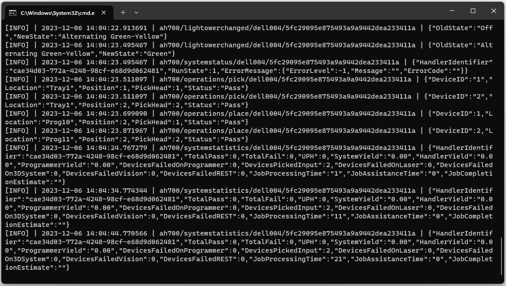
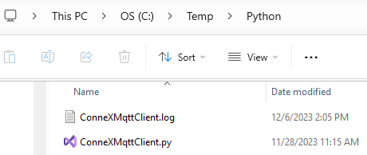

# ConneXMqttClient Script

The ConneXMqttClient script is an example of how to implement a simple MQTT client to monitor ConneX MQTT messages using Python. The script requires the [paho.mqtt](https://pypi.org/project/paho.mqtt/) (Eclipse Paho MQTT Python client) library installed in our environment. 

The script can be setup to monitor specific topics or all topics. It outputs the messages to both the console and a log file. In the following sections there are descriptions of the script functionality.

## Logging

A custom logger is created to handle sending simultaneously the message traffic to both the console and a log file called `ConneXMqttClient.log`. A custom formatter is also used to include uSecs in the logging timestamps.

```python
# Create a custom logger
logger = logging.getLogger(__name__)

# Create two log handlers, one for console output and one for file output
c_handler = logging.StreamHandler()
f_handler = logging.FileHandler("ConneXMqttClient.log")
c_handler.setLevel(logging.INFO)
f_handler.setLevel(logging.INFO)

# Create formatters and add them to handlers
c_format = uSecsFormatter(fmt="[%(levelname)s] | %(asctime)s | %(message)s", datefmt="%Y-%m-%d %H:%M:%S.%f")
f_format = uSecsFormatter(fmt="[%(levelname)s] | %(asctime)s | %(message)s", datefmt="%Y-%m-%d %H:%M:%S.%f")
c_handler.setFormatter(c_format)
f_handler.setFormatter(f_format)

# Add handlers to the logger
logger.addHandler(c_handler)
logger.addHandler(f_handler)

# Set logger threshold level
logger.setLevel(logging.INFO)
```

## Passing Arguments

The script can be called using arguments to change the default connection settings, an argument parser is initialized to accept the optional arguments.

```python
# Initialize argument parser
parser = argparse.ArgumentParser(usage=__doc__)

# Adding optional arguments
parser.add_argument("-i", "--iphost", help="ConneX MQTT Broker IP address or host name, default = localhost")
parser.add_argument("-p", "--port", type=int, help="ConneX MQTT Broker port, default = 1883")
```

## Parse Arguments Function

A parse arguments function is defined to set the default values to use and parse the arguments from the invocation command when required.

```python
# Parse command line arguments
def parseArguments():
    # Set default return values
    host, port = "localhost", 1883

    # Read arguments from command line
    args = parser.parse_args()     
    if args.iphost:
        host = args.iphost
    if args.port:
        port = int(args.port)
    return (host, port)
```

## Subscribe Function

A function is defined to subscribe to a topic and log a message to indicate the subscribed topic.

```python
# Subscribe to specified topic
def subscribe(client, topic):
    # Subscribe to topic
    client.subscribe(topic)    
    if topic == '#':
        logger.info("Subscribed to all event messages...")
    else:
        logger.info(f"Subscribed to '{topic}' event messages...")
```

## On Connect Function

This is a callback function that gets called whenever the MQTT client receives a CONNACK (connection acknowledge) from the MQTT server. 

In this example we are using this callback to determine whether the client connected successfully by checking the value of the `rc` (result code) parameter. If the client connected successfully, we then proceed to subscribe to the ConneX MQTT topics we are interested on monitoring.

By default we are subscribing to all topics, there are examples to subscribe to different topics, these are commented out.

```python
# The callback for when the client receives a CONNACK response from the server.
def on_connect(client, userdata, flags, rc):
    if rc == 0:
        logger.info(f"Successfully connected to ConneX MQTT Broker!!!, client_id: {client._client_id.decode()}")
        
        # Subscribing in on_connect() means that if we lose the connection and
        # reconnect then subscriptions will be renewed.
        
        # Uncomment the example you want to test

        # Subscribe to light tower changed topic
        #subscribe(client, "ah700/lightowerchanged/#")

        # Subscribe to pick operations topic
        #subscribe(client, "ah700/operations/pick/#")

        # Subscribe to place operations topic
        #subscribe(client, "ah700/operations/place/#")

        # Subscribe to all topics
        subscribe(client, "#")
    else:
        logger.info(f"Failed to connect to ConneX MQTT Broker, result code: {rc}")
```

## On Message Function

This is a callback function that gets called whenever the client receives a PUBLISH message from the ConneX MQTT server for a topic that we subscribed to. In this example we simply log the received message to the console and log file, decoding the payload to use it as a string.

```python
# The callback for when a PUBLISH message is received from the server.
def on_message(client, userdata, msg):
    logger.info(f"{msg.topic} | {msg.payload.decode()}")
```

## On Disconnect Function

This is a callback function that gets called whenever the MQTT server sends a disconnect message. In this example we just log the id of the client that was disconnected and additional information that could help in debugging efforts in case of an unexpected disconnect.

```python
# The callback for when a disconnect happens.
def on_disconnect(client, rc, properties):
    logger.info(f"Disconnected... client: {client._client_id.decode()}, return code: {rc}, properties: {properties}")
```

## Main function

In the main function we initialize the MQTT client using the default (or parsed from arguments) connection settings and then we start an infinite loop to process all the messages that we subscribed to. In the client initialization we use a random id to make it possible that different executions of the script can coexist without conflicting each other.

```python
# main program
def main():
    # Get host and port values to use for connecting to ConneX MQTT Broker
    host, port = parseArguments()
    
    # Add log start header, useful when several logs are appended to the same file
    logger.info("----------------------------------------------------------------------")
    logger.info("-------------------------- Starting new log --------------------------")
    logger.info("----------------------------------------------------------------------")

    # Initialize MQTT client, generate random id
    client = mqtt.Client(client_id=f'connex-mqtt-{random.randint(0, 1000)}')
    client.on_connect = on_connect
    client.on_message = on_message
    client.on_disconnect = on_disconnect
    # Use "localhost" if ConneX service is running in same machine
    # otherwise use IP address of machine where ConneX service is installed
    try:
        logger.info(f"Attempting connection to ConneX MQTT Broker... Host: {host}, Port: {port}")
        client.connect(host, port, 60)

        # Blocking call that processes network traffic, dispatches callbacks and
        # handles reconnecting.
        # Other loop*() functions are available that give a threaded interface and a
        # manual interface.
        client.loop_forever()
    except Exception as e:
        logger.exception("An exception occurred, could not connect to ConneX MQTT Broker...") 
        input("Press any key to continue...")

# Script entry point
if __name__ == '__main__':
    main()
```

## Running the Script

To run the script all we need to do is to execute the `python` command from a command line window, passing the name of the script `ConneXMqttClient.py` as argument. The optional arguments can be indicated as well.

Example of executing the script with the optional `--help` argument:

```
Microsoft Windows [Version 10.0.22621.2715]
(c) Microsoft Corporation. All rights reserved.

C:\Temp\Python>python ConneXMqttClient.py --help
usage:
ConneX MQTT Client sample code.

ConneXMqttClient [-h] [-i IPHOST] [-p PORT]

This script allows the user to connect to a ConneX MQTT Broker.

When successful, the script will log the subscribed event messages to
both the console and a log file named 'ConneXMqttClient.log'.

This script requires that `paho.mqtt` be installed within the Python
environment you are running this script in.

To stop the script, simply press CTRL+C to abort the execution.

options:
  -h, --help            show this help message and exit
  -i IPHOST, --iphost IPHOST
                        ConneX MQTT Broker IP address or host name, default = localhost
  -p PORT, --port PORT  ConneX MQTT Broker port, default = 1883

C:\Temp\Python>
```

Example of executing the script connecting with ConneX MQTT Server with IP address 10.0.51.167:

```
C:\Temp\Python>python ConneXMqttClient.py --iphost 10.0.51.167
[INFO] | 2023-12-06 14:01:14.307713 | ----------------------------------------------------------------------
[INFO] | 2023-12-06 14:01:14.307713 | -------------------------- Starting new log --------------------------
[INFO] | 2023-12-06 14:01:14.307713 | ----------------------------------------------------------------------
[INFO] | 2023-12-06 14:01:14.307713 | Attempting connection to ConneX MQTT Broker... Host: 10.0.51.167, Port: 1883
[INFO] | 2023-12-06 14:01:14.312720 | Successfully connected to ConneX MQTT Broker!!!, client_id: connex-mqtt-585
[INFO] | 2023-12-06 14:01:14.312720 | Subscribed to all event messages...
```

The output will be shown in the console and saved in a log file.



The script file should be in the folder from where the `python` command is invoked.

The script will keep running until the execution is aborted by pressing 'CTRL+C'.

## Log File

The `ConneXMqttClient.log` file is created in the same folder where the script is located. 



The following is an example of a complete log for a DMS job run of 2 devices:

```
[INFO] | 2023-12-06 14:01:14.307713 | ----------------------------------------------------------------------
[INFO] | 2023-12-06 14:01:14.307713 | -------------------------- Starting new log --------------------------
[INFO] | 2023-12-06 14:01:14.307713 | ----------------------------------------------------------------------
[INFO] | 2023-12-06 14:01:14.307713 | Attempting connection to ConneX MQTT Broker... Host: 10.0.51.167, Port: 1883
[INFO] | 2023-12-06 14:01:14.312720 | Successfully connected to ConneX MQTT Broker!!!, client_id: connex-mqtt-585
[INFO] | 2023-12-06 14:01:14.312720 | Subscribed to all event messages...
[INFO] | 2023-12-06 14:04:09.497445 | ah700/startup/dell004/5fc29095e875493a9a9442dea233411a | {"MachineType":"Desktop Mode","Active":true}
[INFO] | 2023-12-06 14:04:09.497445 | ah700/systemstatus/dell004/5fc29095e875493a9a9442dea233411a | {"HandlerIdentifier":"cae34d03-772a-4248-98cf-e68d9d062481","RunState":0,"ErrorMessage":{"ErrorLevel":-1,"Message":"","ErrorCode":""}}
[INFO] | 2023-12-06 14:04:09.749365 | ah700/lightowerchanged/dell004/5fc29095e875493a9a9442dea233411a | {"OldState":"Off","NewState":"Red"}
[INFO] | 2023-12-06 14:04:09.749365 | ah700/lightowerchanged/dell004/5fc29095e875493a9a9442dea233411a | {"OldState":"Red","NewState":"Off"}
[INFO] | 2023-12-06 14:04:09.749365 | ah700/systemstatus/dell004/5fc29095e875493a9a9442dea233411a | {"HandlerIdentifier":"cae34d03-772a-4248-98cf-e68d9d062481","RunState":2,"ErrorMessage":{"ErrorLevel":1,"Message":"Prog10 Socket 1 Adapter life has been exceeded. 8533  Limit: 5000\r\nProg10 Socket 2 Adapter life has been exceeded. 8179  Limit: 5000\r\nProg11 Socket 2 Adapter life has been exceeded. 99872  Limit: 5000\r\n\r\nProg11 Socket 3 OK 1  Limit: 5000\r\n","ErrorCode":""}}
[INFO] | 2023-12-06 14:04:12.818137 | ah700/lightowerchanged/dell004/5fc29095e875493a9a9442dea233411a | {"OldState":"Off","NewState":"Yellow"}
[INFO] | 2023-12-06 14:04:12.881046 | ah700/users/login/dell004/5fc29095e875493a9a9442dea233411a | {"Username":"Niceforo","Success":true}
[INFO] | 2023-12-06 14:04:12.990906 | ah700/systemstatus/dell004/5fc29095e875493a9a9442dea233411a | {"HandlerIdentifier":"cae34d03-772a-4248-98cf-e68d9d062481","RunState":0,"ErrorMessage":{"ErrorLevel":-1,"Message":"","ErrorCode":""}}
[INFO] | 2023-12-06 14:04:22.082590 | ah700/beginrun/dell004/5fc29095e875493a9a9442dea233411a | {"MachineParametersFile":{"HBOT_VEL":1500000,"HBOT_ACCEL":1E+08,"HBOT_DECEL":1E+08,"HBOT_JERK":2E+08,"HBOT_HOMING_VEL":30000,"X_ZERO_OFFSET_FROM_HOME":785000,"Y_ZERO_OFFSET_FROM_HOME":680000,"X_MAX":785000,"Y_MAX":680000,"X_MIN":19000,"Y_MIN":25000,"X_PARK":700000,"Y_PARK":667000,"Z_VEL":570000,"Z_ACCEL":6E+08,"Z_DECEL":6E+08,"Z_JERK":5E+08,"Z_HOMING_VEL":5800,"Z_MAX":3000,"Z_MIN":-49000,"Z_PARK":0,"ROT_VEL":6000,"ROT_ACCEL":5000000,"ROT_DECEL":5000000,"ROT_JERK":1000000,"ROTATION_HOMING_VEL":3600,"ROT_MAX":720,"ROT_MIN":-720,"ROT_PARK":0,"COR_X_HEAD_1":-33222,"COR_X_HEAD_2":33132,"X_DIST_BETWEEN_HEAD_1_AND_HEAD_2":66043,"Y_DIST_BETWEEN_HEAD_1_AND_HEAD_2":-298,"X_P1":269969,"Y_P1":518251,"ROT_P1":0.441,"X_P2":270016,"Y_P2":417518,"ROT_P2":-0.177,"X_P3":269629,"Y_P3":315375,"ROT_P3":0.338,"X_P4":268857,"Y_P4":215275,"ROT_P4":-0.725,"X_P5":456749,"Y_P5":222844,"ROT_P5":-0.157,"X_P6":465000,"Y_P6":170000,"ROT_P6":0,"X_P7":460000,"Y_P7":106400,"ROT_P7":0,"X_P8":455000,"Y_P8":24350,"ROT_P8":0,"X_P9":275000,"Y_P9":233000,"ROT_P9":0,"X_P10":261173,"Y_P10":325183,"ROT_P10":-0.229,"X_P11":261594,"Y_P11":426390,"ROT_P11":0.689,"X_P12":275000,"Y_P12":25400,"ROT_P12":0,"X_P13":398928,"Y_P13":121457,"ROT_P13":0,"X_P14":180000,"Y_P14":140000,"ROT_P14":0,"X_P15":0,"Y_P15":0,"ROT_P15":0,"X_P16":270000,"Y_P16":320000,"ROT_P16":0,"X_P17":270000,"Y_P17":320000,"ROT_P17":0,"X_P18":270000,"Y_P18":320000,"ROT_P18":0,"X_P19":270000,"Y_P19":320000,"ROT_P19":0,"X_P20":270000,"Y_P20":320000,"ROT_P20":0,"X_P21":270000,"Y_P21":320000,"ROT_P21":0,"X_P22":270000,"Y_P22":320000,"ROT_P22":0,"X_P23":270000,"Y_P23":320000,"ROT_P23":0,"X_P24":270000,"Y_P24":320000,"ROT_P24":0,"X_TOOL":300000,"Y_TOOL":100000,"Z_TOOL":-2000,"Z_PARK_COR_MEASUREMENT":-15000,"THETA_ENCODER":2048,"X_SITE_1_SKT_DIST":89965,"Y_SITE_1_SKT_DIST":545,"X_SITE_2_SKT_DIST":90062,"Y_SITE_2_SKT_DIST":90033,"X_SITE_3_SKT_DIST":90033,"Y_SITE_3_SKT_DIST":89898,"X_SITE_4_SKT_DIST":89898,"Y_SITE_4_SKT_DIST":90151,"X_SITE_5_SKT_DIST":90151,"Y_SITE_5_SKT_DIST":11810,"X_SITE_6_SKT_DIST":11810,"Y_SITE_6_SKT_DIST":11827,"X_SITE_7_SKT_DIST":11827,"Y_SITE_7_SKT_DIST":11797,"X_SITE_8_SKT_DIST":11797,"Y_SITE_8_SKT_DIST":11830,"X_SITE_9_SKT_DIST":11830,"Y_SITE_9_SKT_DIST":73617,"X_SITE_10_SKT_DIST":73617,"Y_SITE_10_SKT_DIST":73693,"X_SITE_11_SKT_DIST":73693,"Y_SITE_11_SKT_DIST":11827,"X_SITE_12_SKT_DIST":11827,"Y_SITE_12_SKT_DIST":11827,"X_SITE_13_SKT_DIST":11827,"Y_SITE_13_SKT_DIST":52000,"X_SITE_14_SKT_DIST":52000,"Y_SITE_14_SKT_DIST":11827,"X_SITE_15_SKT_DIST":11827,"Y_SITE_15_SKT_DIST":52000,"X_SITE_16_SKT_DIST":52000,"Y_SITE_16_SKT_DIST":52000,"X_SITE_17_SKT_DIST":52000,"Y_SITE_17_SKT_DIST":52000,"X_SITE_18_SKT_DIST":52000,"Y_SITE_18_SKT_DIST":52000,"X_SITE_19_SKT_DIST":52000,"Y_SITE_19_SKT_DIST":52000,"X_SITE_20_SKT_DIST":52000,"Y_SITE_20_SKT_DIST":52000,"X_SITE_21_SKT_DIST":52000,"Y_SITE_21_SKT_DIST":52000,"X_SITE_22_SKT_DIST":52000,"Y_SITE_22_SKT_DIST":52000,"X_SITE_23_SKT_DIST":52000,"Y_SITE_23_SKT_DIST":52000,"X_SITE_24_SKT_DIST":52000,"Y_SITE_24_SKT_DIST":100,"TRIM_VALUE_FOR_LEVELING_THE_LASER_ROTARY":100,"TRIM_VALUE_FOR_LEVELING_THE_LASER34_ROTARY":-18000,"GANTRY_X_LASER_SHUTTLE1":299808,"GANTRY_Y_LASER_SHUTTLE1":610561,"CROSS_HAIR_X":-60000,"CROSS_HAIR_Y":-17000,"ROT_LASER_SHUTTLE1":0,"LASER_CUPS_X_DIST_DEFAULT":66000,"LASER_CUPS_Y_DIST_DEFAULT":0,"MAX_DERIVATIVE_CYBEROPTICS_UPPER_TOLERANCE":28,"ANGLE_BETWEEN_HEAD_1_AND_HEAD_2":0,"HEAD1_HEAD2_INSTALLED":3,"PNP_HEAD_REVISION":2,"Z1_HEIGHT_FOR_HEADSXY_MEASURMENT1":0,"Z2_HEIGHT_FOR_HEADSXY_MEASURMENT2":0,"X_DIST_AT_Z2_BETWEEN_HEAD_1_AND_HEAD_2":0,"Y_DIST_AT_Z2_BETWEEN_HEAD_1_AND_HEAD_2":0,"GANTRY_LUBRICATION_MAINTENANCE_EXPECTATION":2160,"GANTRY_LUBRICATION_MAINTENANCE_REMAINING":2069,"DIST_BETWEEN_2D_AND_TAPEOUT_DROP":320,"DIST_BETWEEN_2D_AND_TAPE_CUT":380,"STAY_IN_GANTRY_SCREEN_IF_ONE_HEADSXY_UNSUCCESSFUL":0,"3D_X_IS_NOT_INVERSE":0,"3D_Y_IS_NOT_INVERSE":0,"OFFSET__F_Z_ZLASER_RELATIVE_TO_PARK":20366,"FAKTOR_SPAN":10000,"F_X_ZLASER":-34958,"F_Y_ZLASER":10686,"3D_X":300000,"3D_Y":300000,"VERSION_OF_MACHINE_FILE":1,"Z-MIN_AT_TAPEOUT_USED_AT_TEACHING":-50000,"LASER_POWER":0,"LASER_POWER_MAX":0,"LASER_SCAN_SPEED":0,"LASER_FREQUENCY":0},"PackageParametersFile":{"ENABLE_SAFETY_SHIELDS":1,"LASER_POLLING_DELAY":1000,"USE_VAC_SWITCHES":1,"ENABLE_CUPS":0,"USAGE_OF_BOTH_HEADS_R_AXIS":3,"3D_CONSEC_ERROR":5,"PROGRAMMER_SIMULATION":0,"CONSECUTIVE_ERR_VISION":1,"CONSECUTIVE_ERRORS":2,"IGNORE_HEAD_VACUUM":0,"PICK_TIME_IO":0,"VAC_ON_BEFORE_PICK":3,"RECOMENDED_NOZZLE":60,"PICK_RETRY_STEP":-150,"PICK_ATTEMPTS":2,"PICK_TIME_SOCKETS":0,"PICK_OFFSET":0,"LASER_ALIGN":4,"3D_INSPECT":0,"PUFF_TIME_SOCKETS":0,"VAC_PAUSE":0,"DEV_WIDTH_LONG":24000,"DEV_WIDTH_SHORT":24000,"DEVICE_SHAPE":5,"DRZ_NOM":0,"PUFF_DURATION_IO":0,"DROP_OFFSET":500,"VISION_OFFSET":-250,"ENABLE_USE_OF_THE_LASER_ASSEMBLY_MECHANISM":0,"VIBRATOR_DURATION":500,"INPUT_OUTPUT_MODE":0,"DEBUG_MODE_AT_POWERUP":1,"Z_OFFSET_CUP1":0,"DISABLE_TRAY_SORT_END_OF_JOB":1,"OUTPUT_TUBE_QTY":20,"TAPE_ADV_DELAY":150,"TR1_PREDROP":2000,"TR2_PREDROP":2000,"TRAY_1_USAGE":8,"TRAY_2_USAGE":8,"TRAY_3_USAGE":256,"TUBE_1_USAGE":256,"TUBE_2_USAGE":256,"TWO_STEP_3D":1,"TAPEOUT_STD_FUNCTION":0,"LABELER_IN_LOOP":0,"TRAYFEEDER_PARAMETERS":"C:\\AH700\\COMMON\\RSTACKER_ROBOTPARAMETERS.XML","X_SIZE_OF_DEVICE_AT_TRAY":20000,"Y_SIZE_OF_DEVICE_AT_TRAY":10,"X_LEFT_EDGE_OF_TRAY_TO_CENTER_OF_DEVICE_1":17272,"Y_TOP_EDGE_OF_TRAY_TO_CENTER_OF_DEVICE_1":18288,"TRAY_X_COLUMNS":8,"TRAY_Y_ROWS":12,"TRAY_CHIPSIZE_X":14887,"TRAY_CHIPSIZE_Y":25650,"TRAY1_X":464706,"TRAY1_Y":641826,"TRAY1_Z_DROP":-15150,"TRAY1_Z_PICK":-15900,"TRAY1_R":-91.429,"TRAY2_X":661436,"TRAY2_Y":640977,"TRAY2_Z_DROP":-14550,"TRAY2_Z_PICK":-15300,"TRAY2_R":-90.782,"TRAY3_X":240000,"TRAY3_Y":552274,"TRAY3_Z_DROP":-13410,"TRAY3_Z_PICK":-13525,"TRAY3_R":0.225,"TRAY4_X":106468,"TRAY4_Y":455160,"TRAY4_Z_DROP":-14550,"TRAY4_Z_PICK":-15300,"TRAY4_R":-90.466,"TRAY4_ROWS_IN_X":8,"TRAY4_COLUMNS_IN_Y":12,"TRAY4_CHIPSIZE_X":0,"TRAY4_CHIPSIZE_Y":0,"TRAY2_X_ROWS":0,"TRAY2_Y_COLUMNS":0,"TRAY2_X_DISTANCE_BETWEEN_DEVICES":14931,"TRAY2_Y_DISTANCE_BETWEEN_DEVICES":25590,"TRAY_FEEDER_TIMEOUT":12000,"DUAL_PICK_AT_LASER":0,"LABEL_PICK_DELAY":750,"MOTION_DEBUG_LOGGING":9557,"TAPEOUT_DISTANCE_BETWEEN_POCKETS_X":10000,"TAPEOUT_DISTANCE_BETWEEN_POCKETS_Y":0,"TAPEOUT_DUAL_DROP":0,"TAPER_PARAM_PATH":"C:\\AH700\\COMMON\\Taper_RobotParameters.xml","TAPE_FEEDER_LOCATION_X":141295,"TAPE_FEEDER_LOCATION_Y":25590,"TAPE_Z_DROP":-19650,"TAPE_Z_PICK":-20400,"TAPE_ROT":-90,"COORDINATED_MOTION":0,"VIB1_X":85000,"VIB1_Y":41750,"VIB1_Z_DROP":-1198,"VIB1_Z_PICK":-1550,"VIB1_R":0,"VIB2_X":151000,"VIB2_Y":38000,"VIB2_Z_DROP":-1200,"VIB2_Z_PICK":-1500,"VIB2_R":0,"X_MARKING_OFFSET_CUP24":66000,"Y_MARKING_OFFSET_CUP24":0,"LASER_CUP1_PICKDROP":-33000,"LASER_CUP2_PICKDROP":-33000,"LASER_CUP3_PICKDROP":-33000,"LASER_CUP4_PICKDROP":-33000,"PNP_WAIT_FOR_TFSHUTTLE":0,"COUNT_3D_RETRIES":0,"CHECK_DEVICE_AT_TIP":0,"DAIO_SERVICE":0,"TUBE_CHIPSIZE_X":78100,"TUBE_X_COLUMNS":5,"TUBE_RACK_GRAPHICS":12000,"LABEL_STATION_X":35350,"LABEL_STATION_Y":12950,"LABEL_STATION_DROP":-300,"LABEL_STATION_PICK":-770,"LABEL_STATION_ROT":0,"DELTAX_TRAY1":-40,"DELTAY_TRAY1":-12,"DELTAX_TRAY2":-377,"DELTAY_TRAY2":-199,"DELTAX_TRAY3":-40,"DELTAY_TRAY3":-12,"PROG_1_Z_DROP":-38970,"PROG_1_Z_PICK":-39720,"PROG_2_Z_DROP":-38910,"PROG_2_Z_PICK":-39660,"PROG_3_Z_DROP":-38850,"PROG_3_Z_PICK":-39600,"PROG_4_Z_DROP":-38430,"PROG_4_Z_PICK":-39180,"PROG_5_Z_DROP":-30610,"PROG_5_Z_PICK":-30360,"PROG_6_Z_DROP":-30000,"PROG_6_Z_PICK":-30000,"PROG_7_Z_DROP":-30000,"PROG_7_Z_PICK":-30000,"PROG_8_Z_DROP":-30000,"PROG_8_Z_PICK":-30000,"PROG_9_Z_DROP":-30000,"PROG_9_Z_PICK":-30000,"PROG_10_Z_DROP":-30350,"PROG_10_Z_PICK":-30550,"PROG_11_Z_DROP":-30430,"PROG_11_Z_PICK":-30180,"PROG_12_Z_DROP":-30000,"PROG_12_Z_PICK":-30000,"PROG_13_Z_DROP":-30000,"PROG_13_Z_PICK":-30000,"PROG_14_Z_DROP":-30000,"PROG_14_Z_PICK":-30000,"PROG_15_Z_DROP":-30000,"PROG_15_Z_PICK":-30000,"PROG_16_Z_DROP":-30000,"PROG_16_Z_PICK":-30000,"PROG_17_Z_DROP":-30000,"PROG_17_Z_PICK":-30000,"PROG_18_Z_DROP":-30000,"PROG_18_Z_PICK":-30000,"PROG_19_Z_DROP":-30000,"PROG_19_Z_PICK":-30000,"PROG_20_Z_DROP":-30000,"PROG_20_Z_PICK":-30000,"PROG_21_Z_DROP":-30000,"PROG_21_Z_PICK":-30000,"PROG_22_Z_DROP":-30000,"PROG_22_Z_PICK":-30000,"PROG_23_Z_DROP":-30000,"PROG_23_Z_PICK":-30000,"PROG_24_Z_DROP":-30000,"PROG_24_Z_PICK":-30000,"TRAY4_X_DISTANCE_BETWEEN_DEVICES":14820,"TRAY4_Y_DISTANCE_BETWEEN_DEVICES":25511,"TAPEOUT_X":146830,"TAPEOUT_Y":674699,"TAPEOUT_Z_DROP":-20000,"TAPEOUT_Z_PICK":-21000,"TAPEOUT_R":0,"VISION_MAX_ROT_ERROR_LIMIT":20,"LASER_VAC_TIME_DURING_PICK":0,"DELAY_BETWEEN_DROPPING_2_CONSECUTIVE_DEVICES_TUBEOUT":500,"DELAY_FROM_START_OPENER_DOWN_TO_START_NOZZLE_DOWN":500,"DELAY_FOR_TUBEIN_TOGGLE_TIME":0,"DELAY_BEFORE_3D_INSPECTION":15,"FLASHCORE_SOCKET_MASK":0,"3D_X":300000,"3D_Y":300000,"3D_Z_DROP":-20000,"3D_Z_PICK":-20000,"3D_R":0,"NUMBER_OF_PASS_DEVICES_IN_OUTPUT_TO_START_EST":1200000,"F_Z1_PARK":-1210,"F_Z2_PARK":-1030,"DELTA_X_FROM_TRAY_4_CORNER_3_CORRECTION":0,"DELTA_Y_FROM_TRAY_4_CORNER_3_CORRECTION":0,"DELAY_BEFORE_MEASURING_DEVICE":0,"MAX_XY_TOLERANCE_FOR_PROGRAMMER_NEXTEACH":80,"MIN_DELAY_BETWEEN_XY_MOVE_AND_DROP_INTO_PROGRAMMER":10,"VERSION_OF_PACKAGE_FILE":2,"MEASURE_HEIGHT_FOR_TIP_ABOVE_SURFACE":300,"DELAY_BEFORE_SECOND_TAPE_OUTPUT_ADVANCE":0,"DISPLAY_RECOMMENDED_PNP_TIP_MESSAGE":0,"3D_FAIL_SKT_DISABLE":50,"AFTER_N_DEVICES_IN_THE_TAPEOUT_STOP":0,"TAPEOUT_POCKET_PITCH":20,"TAPEOUT_TRAILER(INNER)LENGTH":0,"TAPEOUT_LEADER(OUTER)LENGTH":0,"NUMBER_OF_ALLOWED_EMPTY_POCKETS_IN_TAPEOUT_FOR_A_LOT":0,"NUMBER_OF_ALLOWED_CONSECUTIVE_EMPTY_POCKETS_IN_TAPEOUT_FOR_A_LOT":0,"FAIL_RETRY_SUPERCEED_INI":-1,"CONT_RETRY_SUPERCEED_INI":-1,"TOLERANCE_FOR_VISION_FAIL_EACH_LENGTH_OF_DEVICE":10,"ACTUATION_COUNTER_MESSAGE":0,"UFS_ADAPTER_MESSAGE":0,"EST_TIMEOUT":10,"DEVICE_OFFSET_IN_SOCKET_LIMIT":0,"PICK_OFFSET_ADJ_ZSENSOR":0,"XY-TOLERANCE_IO_MEDIA_NEXTEACH":150,"FAILBOX_1_X":106468,"FAILBOX_1_Y":455160,"FAILBOX_1_Z_DROP":-14550,"FAILBOX_2_X":106468,"FAILBOX_2_Y":455160,"FAILBOX_2_Z_DROP":-14550,"PROBE_DIAMETER_MASTER":0,"TRAY_PICK_FAIL_HALT_COUNT":0,"LASER_POWER_MIN":0,"LASER_POWER_MAX":0,"LASER_SCAN_SPEED":0,"LASER_FREQUENCY":0,"OPEN_TRAY_HOLDER_LOCKS_AT_JOB_FINISH":0,"PROGRAMMER_TO_BE_USED_AS_SERILIZER":0,"TRAY2_Y_ROWS":12,"TRAY2_X_COLUMNS":8,"SOCKETS_PER_ADAPTER":8},"WinAH400INIFile":{"InitializedSites":"10,11","RRFlashPgmr":"0","Viper":"0","LumenX":"10,11","EmptySocketTestEnabled":false,"RecurrentEmptySocketTestEnabled":false,"DesktopMode":true},"TaskName":"VERIFY MEMORY (2GB)","xH700Version":"AH700 3.5.0","MachineID":"PSV7000","Sumcheck":"78608BE3","VisionInspectionProjectFile":"","LaserMarkingProjectFile":"","3DInspectionProjectFile":"","2DInpectionProjectFile":"","IgnoreProgrammers":"False"}
[INFO] | 2023-12-06 14:04:22.082590 | ah700/systemstatus/dell004/5fc29095e875493a9a9442dea233411a | {"HandlerIdentifier":"cae34d03-772a-4248-98cf-e68d9d062481","RunState":1,"ErrorMessage":{"ErrorLevel":-1,"Message":"","ErrorCode":""}}
[INFO] | 2023-12-06 14:04:22.412113 | ah700/lightowerchanged/dell004/5fc29095e875493a9a9442dea233411a | {"OldState":"Yellow","NewState":"Green"}
[INFO] | 2023-12-06 14:04:22.412113 | ah700/lightowerchanged/dell004/5fc29095e875493a9a9442dea233411a | {"OldState":"Green","NewState":"Off"}
[INFO] | 2023-12-06 14:04:22.412113 | ah700/systemstatus/dell004/5fc29095e875493a9a9442dea233411a | {"HandlerIdentifier":"cae34d03-772a-4248-98cf-e68d9d062481","RunState":2,"ErrorMessage":{"ErrorLevel":1,"Message":"Warning! \r\n\r\n1. Danger of UNPROGRAMMED DEVICES\r\nPlease check that all programmer sockets are EMPTY.\r\nOtherwise there is a danger that unprogrammed devices get delivered to the output.\r\n\r\n2. Danger of DAMAGE TO THE PNP HEAD\r\nPlease verify that there are no obstructions in the handler work area (Programmer socket adapter clamps, socket actuator plates resting on programmers, tools).\r\n\r\n","ErrorCode":""}}
[INFO] | 2023-12-06 14:04:22.913691 | ah700/lightowerchanged/dell004/5fc29095e875493a9a9442dea233411a | {"OldState":"Off","NewState":"Alternating Green-Yellow"}
[INFO] | 2023-12-06 14:04:23.495467 | ah700/lightowerchanged/dell004/5fc29095e875493a9a9442dea233411a | {"OldState":"Alternating Green-Yellow","NewState":"Green"}
[INFO] | 2023-12-06 14:04:23.495467 | ah700/systemstatus/dell004/5fc29095e875493a9a9442dea233411a | {"HandlerIdentifier":"cae34d03-772a-4248-98cf-e68d9d062481","RunState":1,"ErrorMessage":{"ErrorLevel":-1,"Message":"","ErrorCode":""}}
[INFO] | 2023-12-06 14:04:23.511097 | ah700/operations/pick/dell004/5fc29095e875493a9a9442dea233411a | {"DeviceID":"1","Location":"Tray1","Position":1,"PickHead":1,"Status":"Pass"}
[INFO] | 2023-12-06 14:04:23.511097 | ah700/operations/pick/dell004/5fc29095e875493a9a9442dea233411a | {"DeviceID":"2","Location":"Tray1","Position":2,"PickHead":2,"Status":"Pass"}
[INFO] | 2023-12-06 14:04:23.699090 | ah700/operations/place/dell004/5fc29095e875493a9a9442dea233411a | {"DeviceID":1,"Location":"Prog10","Position":2,"PickHead":1,"Status":"Pass"}
[INFO] | 2023-12-06 14:04:23.871967 | ah700/operations/place/dell004/5fc29095e875493a9a9442dea233411a | {"DeviceID":2,"Location":"Prog11","Position":2,"PickHead":2,"Status":"Pass"}
[INFO] | 2023-12-06 14:04:24.767279 | ah700/systemstatistics/dell004/5fc29095e875493a9a9442dea233411a | {"HandlerIdentifier":"cae34d03-772a-4248-98cf-e68d9d062481","TotalPass":0,"TotalFail":0,"UPH":0,"SystemYield":"0.00","HandlerYield":"0.00","ProgrammerYield":"0.00","DevicesFailedOnProgrammer":0,"DevicesPickedInput":2,"DevicesFailedOnLaser":0,"DevicesFailedOn3DSystem":0,"DevicesFailedVision":0,"DevicesFailedREST":0,"JobProcessingTime":"1","JobAssistanceTime":"0","JobCompletionEstimate":""}
[INFO] | 2023-12-06 14:04:34.774344 | ah700/systemstatistics/dell004/5fc29095e875493a9a9442dea233411a | {"HandlerIdentifier":"cae34d03-772a-4248-98cf-e68d9d062481","TotalPass":0,"TotalFail":0,"UPH":0,"SystemYield":"0.00","HandlerYield":"0.00","ProgrammerYield":"0.00","DevicesFailedOnProgrammer":0,"DevicesPickedInput":2,"DevicesFailedOnLaser":0,"DevicesFailedOn3DSystem":0,"DevicesFailedVision":0,"DevicesFailedREST":0,"JobProcessingTime":"11","JobAssistanceTime":"0","JobCompletionEstimate":""}
[INFO] | 2023-12-06 14:04:44.770566 | ah700/systemstatistics/dell004/5fc29095e875493a9a9442dea233411a | {"HandlerIdentifier":"cae34d03-772a-4248-98cf-e68d9d062481","TotalPass":0,"TotalFail":0,"UPH":0,"SystemYield":"0.00","HandlerYield":"0.00","ProgrammerYield":"0.00","DevicesFailedOnProgrammer":0,"DevicesPickedInput":2,"DevicesFailedOnLaser":0,"DevicesFailedOn3DSystem":0,"DevicesFailedVision":0,"DevicesFailedREST":0,"JobProcessingTime":"21","JobAssistanceTime":"0","JobCompletionEstimate":""}
[INFO] | 2023-12-06 14:04:54.249014 | connex/programmer/lumenx/legacy/programmingcomplete | [{"TimeStamp":"2023-12-06T14:04:53.0990728Z","Programmer":{"Class":"LumenX","FirmwareVersion":"2.1.1.44","SerialNumber":"001-035-136-002-092-054-021-006-238","SystemVersion":"2.1.1.44","ProgrammerIP":"10.0.0.10","Adapter":{"AdapterId":"110008","AdapterSerialNumber":"001-035-047-173-024-126-008-211-238","CleanCount":"8180","LifetimeActuationCount":"8537","LifetimeContinuityFailCount":"0","LifetimeFailCount":"0","LifetimePassCount":"8180","SocketIndex":"2","AdapterState":"Validated"}},"Job":{"AlgorithmId":"27415240116273152","JobId":"3df1074a-471e-4f9e-8892-bf8d768f17ef","JobName":"Verify Memory (2GB)","JobDescription":"Memory verification job, it does not program, it only performs memory verification.","DeviceName":"KLMDG4UCTA-B041","DeviceManufacturer":"Samsung","DeviceType":"Emmc","DeviceID":"24934","AlgoVersion":"9.4.0"},"PartDetail":{"ChipId":"","RawChipId":"","Result":{"Code":"0","CodeName":"Success","ProgramDuration":0,"VerifyDuration":24300,"Times":null,"AlgoDeviceDetails":{"CID":"CID(127-0):15-01-00-44-55-54-41-34-32-02-D9-D3-B6-39-95-55","device":null,"sentrix":null,"Cnt":"2","eCSD":"eCSD(0-511):00-00-00-00-00-00-00-00-00-00-00-00-00-00-00-00-39-00-00-00-00-00-00-00-00-00-00-00-00-00-00-00-00-00-01-00-00-00-00-00-00-00-00-00-00-00-00-00-00-00-00-00-00-00-00-00-00-00-00-00-00-00-00-00-0F-00-00-C8-C8-C8-80-05-05-00-01-00-00-00-00-00-00-00-00-00-00-00-00-00-00-00-00-00-00-00-00-00-00-00-00-00-00-05-00-00-00-00-00-00-00-00-53-03-00-00-00-00-00-00-00-00-00-00-00-00-00-00-00-00-00-00-01-00-00-00-00-00-00-00-00-00-00-00-00-00-00-00-00-00-00-00-00-00-00-00-00-00-00-69-13-00-07-00-00-00-00-00-14-1F-80-00-00-00-00-00-00-00-00-00-00-00-00-00-00-00-01-01-00-00-00-00-00-00-08-00-02-00-57-1F-0A-02-00-00-00-00-00-00-00-00-00-00-00-01-00-60-8F-0E-07-11-00-07-07-10-01-01-01-07-20-00-07-11-1B-55-02-00-00-00-00-00-00-00-00-1E-00-00-00-00-00-3C-0A-00-00-01-00-00-02-00-00-00-00-00-00-00-00-00-01-60-00-01-01-01-00-00-00-00-00-00-00-00-00-00-00-00-00-00-00-00-00-00-00-00-00-00-00-00-00-00-00-00-00-00-00-00-00-00-00-00-00-0F-01-00-00-00-00-00-00-00-00-00-00-00-00-00-00-00-00-00-00-00-00-00-00-00-00-00-00-00-00-00-00-00-00-00-00-00-00-00-00-00-00-00-00-00-00-00-00-00-00-00-00-00-00-00-00-00-00-00-00-00-00-00-00-00-00-00-00-00-00-00-00-00-00-00-00-00-00-00-00-00-00-00-00-00-00-00-00-00-00-00-00-00-00-00-00-00-00-00-00-00-00-00-00-00-00-00-00-00-00-00-00-00-00-00-00-00-00-00-00-00-00-00-00-00-00-00-00-00-00-00-00-00-00-00-00-00-00-00-00-00-00-00-00-00-00-00-00-00-00-00-00-00-00-00-00-00-00-00-00-00-00-00-00-00-00-00-00-00-00-00-00-00-00-00-00-00-00-00-00-00-00-81-C7-00-00-03-03-07-05-00-02-01-3F-3F-01-01-01-00-00-00-00-00-00-00"},"BlankCheckDuration":"0","EraseDuration":"0","ErrorMessage":"","BytesProgrammed":0,"SocketIndex":"2","Overhead":"4000"}},"HandlerInfo":{"Name":"Dell004","IpAddresses":"192.168.56.1,10.0.0.99,10.0.51.167","Version":"30.0.8.511","MachineSNID":"PSV7000:xxxxxxx","MachineName":"HANDLER-NVC","FactoryName":"","LicenseLevel":null,"PCSerialNumber":"1CXM7V3"},"SerialData":null}]
[INFO] | 2023-12-06 14:04:54.503330 | ah700/operations/pick/dell004/5fc29095e875493a9a9442dea233411a | {"DeviceID":"1","Location":"Prog10","Position":2,"PickHead":1,"Status":"Pass"}
[INFO] | 2023-12-06 14:04:54.531972 | ah700/operations/devicecomplete/dell004/5fc29095e875493a9a9442dea233411a | {"DeviceID":1,"Status":"Pass","ErrorCode":2}
[INFO] | 2023-12-06 14:04:54.547600 | ah700/operations/place/dell004/5fc29095e875493a9a9442dea233411a | {"DeviceID":1,"Location":"Tray1","Position":1,"PickHead":1,"Status":"Pass"}
[INFO] | 2023-12-06 14:04:54.767239 | ah700/systemstatistics/dell004/5fc29095e875493a9a9442dea233411a | {"HandlerIdentifier":"cae34d03-772a-4248-98cf-e68d9d062481","TotalPass":1,"TotalFail":0,"UPH":116,"SystemYield":"50.00","HandlerYield":"50.00","ProgrammerYield":"100.00","DevicesFailedOnProgrammer":0,"DevicesPickedInput":2,"DevicesFailedOnLaser":0,"DevicesFailedOn3DSystem":0,"DevicesFailedVision":0,"DevicesFailedREST":0,"JobProcessingTime":"31","JobAssistanceTime":"0","JobCompletionEstimate":""}
[INFO] | 2023-12-06 14:04:55.304716 | connex/programmer/lumenx/legacy/programmingcomplete | [{"TimeStamp":"2023-12-06T14:04:54.755737Z","Programmer":{"Class":"LumenX","FirmwareVersion":"2.1.1.44","SerialNumber":"001-035-032-021-008-253-056-185-238","SystemVersion":"2.1.1.44","ProgrammerIP":"10.0.0.11","Adapter":{"AdapterId":"110008","AdapterSerialNumber":"001-035-216-109-026-059-090-196-238","CleanCount":"99873","LifetimeActuationCount":"99873","LifetimeContinuityFailCount":"0","LifetimeFailCount":"1","LifetimePassCount":"99872","SocketIndex":"2","AdapterState":"Validated"}},"Job":{"AlgorithmId":"27415240116273152","JobId":"3df1074a-471e-4f9e-8892-bf8d768f17ef","JobName":"Verify Memory (2GB)","JobDescription":"Memory verification job, it does not program, it only performs memory verification.","DeviceName":"KLMDG4UCTA-B041","DeviceManufacturer":"Samsung","DeviceType":"Emmc","DeviceID":"24934","AlgoVersion":"9.4.0"},"PartDetail":{"ChipId":"","RawChipId":"","Result":{"Code":"0","CodeName":"Success","ProgramDuration":0,"VerifyDuration":24300,"Times":null,"AlgoDeviceDetails":{"CID":"CID(127-0):15-01-00-44-55-54-41-34-32-02-D9-D3-B6-38-95-43","device":null,"sentrix":null,"Cnt":"2","eCSD":"eCSD(0-511):00-00-00-00-00-00-00-00-00-00-00-00-00-00-00-00-39-00-00-00-00-00-00-00-00-00-00-00-00-00-00-00-00-00-01-00-00-00-00-00-00-00-00-00-00-00-00-00-00-00-00-00-00-00-00-00-00-00-00-00-00-00-00-00-0F-00-00-C8-C8-C8-80-05-05-00-01-00-00-00-00-00-00-00-00-00-00-00-00-00-00-00-00-00-00-00-00-00-00-00-00-00-00-05-00-00-00-00-00-00-00-00-55-03-00-00-00-00-00-00-00-00-00-00-00-00-00-00-00-00-00-00-01-00-00-00-00-00-00-00-00-00-00-00-00-00-00-00-00-00-00-00-00-00-00-00-00-00-00-69-13-00-07-00-00-00-00-00-14-1F-80-00-00-00-00-00-00-00-00-00-00-00-00-00-00-00-01-01-00-00-00-00-00-00-08-00-02-00-57-1F-0A-02-00-00-00-00-00-00-00-00-00-00-00-01-00-60-8F-0E-07-11-00-07-07-10-01-01-01-07-20-00-07-11-1B-55-02-00-00-00-00-00-00-00-00-1E-00-00-00-00-00-3C-0A-00-00-01-00-00-02-00-00-00-00-00-00-00-00-00-01-60-00-01-01-01-00-00-00-00-00-00-00-00-00-00-00-00-00-00-00-00-00-00-00-00-00-00-00-00-00-00-00-00-00-00-00-00-00-00-00-00-00-0F-01-00-00-00-00-00-00-00-00-00-00-00-00-00-00-00-00-00-00-00-00-00-00-00-00-00-00-00-00-00-00-00-00-00-00-00-00-00-00-00-00-00-00-00-00-00-00-00-00-00-00-00-00-00-00-00-00-00-00-00-00-00-00-00-00-00-00-00-00-00-00-00-00-00-00-00-00-00-00-00-00-00-00-00-00-00-00-00-00-00-00-00-00-00-00-00-00-00-00-00-00-00-00-00-00-00-00-00-00-00-00-00-00-00-00-00-00-00-00-00-00-00-00-00-00-00-00-00-00-00-00-00-00-00-00-00-00-00-00-00-00-00-00-00-00-00-00-00-00-00-00-00-00-00-00-00-00-00-00-00-00-00-00-00-00-00-00-00-00-00-00-00-00-00-00-00-00-00-00-00-00-81-C7-00-00-03-03-07-05-00-02-01-3F-3F-01-01-01-00-00-00-00-00-00-00"},"BlankCheckDuration":"0","EraseDuration":"0","ErrorMessage":"","BytesProgrammed":0,"SocketIndex":"2","Overhead":"5500"}},"HandlerInfo":{"Name":"Dell004","IpAddresses":"192.168.56.1,10.0.0.99,10.0.51.167","Version":"30.0.8.511","MachineSNID":"PSV7000:xxxxxxx","MachineName":"HANDLER-NVC","FactoryName":"","LicenseLevel":null,"PCSerialNumber":"1CXM7V3"},"SerialData":null}]
[INFO] | 2023-12-06 14:04:55.489778 | ah700/operations/pick/dell004/5fc29095e875493a9a9442dea233411a | {"DeviceID":"2","Location":"Prog11","Position":2,"PickHead":1,"Status":"Pass"}
[INFO] | 2023-12-06 14:04:55.520924 | ah700/operations/devicecomplete/dell004/5fc29095e875493a9a9442dea233411a | {"DeviceID":2,"Status":"Pass","ErrorCode":2}
[INFO] | 2023-12-06 14:04:55.520924 | ah700/operations/place/dell004/5fc29095e875493a9a9442dea233411a | {"DeviceID":2,"Location":"Tray1","Position":2,"PickHead":1,"Status":"Pass"}
[INFO] | 2023-12-06 14:04:55.536551 | ah700/lightowerchanged/dell004/5fc29095e875493a9a9442dea233411a | {"OldState":"Green","NewState":"Yellow"}
[INFO] | 2023-12-06 14:04:55.567799 | ah700/lightowerchanged/dell004/5fc29095e875493a9a9442dea233411a | {"OldState":"Yellow","NewState":"Off"}
[INFO] | 2023-12-06 14:04:55.567799 | ah700/systemstatus/dell004/5fc29095e875493a9a9442dea233411a | {"HandlerIdentifier":"cae34d03-772a-4248-98cf-e68d9d062481","RunState":2,"ErrorMessage":{"ErrorLevel":1,"Message":"Pass Limit: 2 finished","ErrorCode":""}}
[INFO] | 2023-12-06 14:04:55.914159 | ah700/lightowerchanged/dell004/5fc29095e875493a9a9442dea233411a | {"OldState":"Off","NewState":"Alternating Green-Yellow"}
[INFO] | 2023-12-06 14:05:04.770543 | ah700/systemstatistics/dell004/5fc29095e875493a9a9442dea233411a | {"HandlerIdentifier":"cae34d03-772a-4248-98cf-e68d9d062481","TotalPass":2,"TotalFail":0,"UPH":176,"SystemYield":"100.00","HandlerYield":"100.00","ProgrammerYield":"100.00","DevicesFailedOnProgrammer":0,"DevicesPickedInput":2,"DevicesFailedOnLaser":0,"DevicesFailedOn3DSystem":0,"DevicesFailedVision":0,"DevicesFailedREST":0,"JobProcessingTime":"41","JobAssistanceTime":"9","JobCompletionEstimate":""}
[INFO] | 2023-12-06 14:05:14.771479 | ah700/systemstatistics/dell004/5fc29095e875493a9a9442dea233411a | {"HandlerIdentifier":"cae34d03-772a-4248-98cf-e68d9d062481","TotalPass":2,"TotalFail":0,"UPH":141,"SystemYield":"100.00","HandlerYield":"100.00","ProgrammerYield":"100.00","DevicesFailedOnProgrammer":0,"DevicesPickedInput":2,"DevicesFailedOnLaser":0,"DevicesFailedOn3DSystem":0,"DevicesFailedVision":0,"DevicesFailedREST":0,"JobProcessingTime":"51","JobAssistanceTime":"19","JobCompletionEstimate":""}
[INFO] | 2023-12-06 14:05:24.773116 | ah700/systemstatistics/dell004/5fc29095e875493a9a9442dea233411a | {"HandlerIdentifier":"cae34d03-772a-4248-98cf-e68d9d062481","TotalPass":2,"TotalFail":0,"UPH":118,"SystemYield":"100.00","HandlerYield":"100.00","ProgrammerYield":"100.00","DevicesFailedOnProgrammer":0,"DevicesPickedInput":2,"DevicesFailedOnLaser":0,"DevicesFailedOn3DSystem":0,"DevicesFailedVision":0,"DevicesFailedREST":0,"JobProcessingTime":"61","JobAssistanceTime":"29","JobCompletionEstimate":""}
[INFO] | 2023-12-06 14:05:28.825445 | ah700/lightowerchanged/dell004/5fc29095e875493a9a9442dea233411a | {"OldState":"Alternating Green-Yellow","NewState":"Yellow"}
[INFO] | 2023-12-06 14:05:31.472205 | ah700/lightowerchanged/dell004/5fc29095e875493a9a9442dea233411a | {"OldState":"Yellow","NewState":"Off"}
[INFO] | 2023-12-06 14:05:31.512974 | ah700/endrun/dell004/5fc29095e875493a9a9442dea233411a | {"HandlerIdentifier":"cae34d03-772a-4248-98cf-e68d9d062481","TerminationReason":"Job Quantity completed","PassQuantity":2,"FailQuantity":0,"DevicesFailedOnProgrammers":0,"DevicesFailedOnLaser":0,"DevicesFailedOn3DSystem":0,"JobProcessingTime":"68","JobAssistanceTime":"36","NominalThroughput":2000,"JobThroughput":106,"DevicesPickedInput":2,"DevicesFailedVision":0,"DevicesFailedREST":0,"DevicesMissingInUse":0,"StartingSerialNumber":"","EndingSerialNumber":"","SerialPassReport":"","SerialFailReport":"","InputMedia":"Trays","OutputMedia":"Trays","Reject1":"Reject Tray","Reject2":"n/a","IgnoreProgrammers":"False"}
[INFO] | 2023-12-06 14:05:32.126209 | ah700/systemstatus/dell004/5fc29095e875493a9a9442dea233411a | {"HandlerIdentifier":"cae34d03-772a-4248-98cf-e68d9d062481","RunState":0,"ErrorMessage":{"ErrorLevel":-1,"Message":"","ErrorCode":""}}
[INFO] | 2023-12-06 14:05:32.126209 | ah700/shutdown/dell004/5fc29095e875493a9a9442dea233411a | {"Active ":false}
```

Everytime we run the script the new logging activity will be appended to the existing log file.
