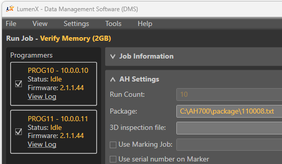
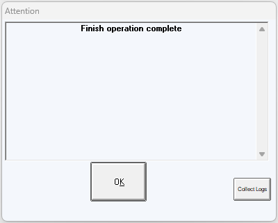

# ConneXMqttCmd Script

The ConneXMqttCmd script is an example of how to implement a simple MQTT client to send ConneX MQTT commands using Python, it is based on the [ConneXMqttClient](../mqtt/ConneXMqttClient.md) script with a few changes to be able to send commands. 

The script requires the following libraries installed in our environment:

- [paho.mqtt](https://pypi.org/project/paho.mqtt/) (Eclipse Paho MQTT Python client)
- [keyboard](https://pypi.org/project/keyboard/) (Hook and simulate global keyboard events on Windows and Linux)

The basic functionality of the script is the same as the [ConneXMqttClient](../mqtt/ConneXMqttClient.md) script, code has been added to use shortcut keys to publish commands to ConneX MQTT Broker. The following sections describe the differences and additions to the script functionality.

## Logging

Same as [ConneXMqttClient](../mqtt/ConneXMqttClient.md#logging), the only change is the name of the generated log file: "ConneXMqttCmd.log".

## Global Variables

We are using some global variables to hold some values that need to be accessed by different functions.

```python
# Initialize auxiliary global variables
connected = False
sessionid = "Undefined"
keep_running = True
```

| Name          | Description                                                                |
|:--------------|:---------------------------------------------------------------------------|
|`connected`    | Indicates the status of the connection with the ConneX MQTT Broker.        |
|`sessionid`    | The session ID for the current instance of the automated handler software. |
|`keep_running` | Indicates whether the script needs to continue running.                    |

## On Connect Function

Same as in [ConneXMqttClient](../mqtt/ConneXMqttClient.md#on-connect-function) with the following changes:
- We are subscribing to all topics, the other example subscriptions were removed.
- Added use of the global variable `connected` to indicate that a connection was established. 

```python
# The callback for when the client receives a CONNACK response from the server.
def on_connect(client, userdata, flags, rc):
    global connected
    if rc == 0:
        logger.info(f"Successfully connected to ConneX MQTT Broker!!!, client_id: {client._client_id.decode()}")
        
        # Subscribing in on_connect() means that if we lose the connection and
        # reconnect then subscriptions will be renewed.

        # Subscribe to all topics
        subscribe(client, "#")
        
        connected = True
    else:
        logger.info(f"Failed to connect to ConneX MQTT Broker, result code: {rc}") 
```

## On Message Function

Same as in [ConneXMqttClient](../mqtt/ConneXMqttClient.md#on-message-function) with the following changes:
- Added logic to parse the `xhsessionid` value from the `startup` topic and store it in the `sessionid` global variable. The value is the 4th level in the topic of the form: `xh700/startup/{hostname}/{xhsessionid}`

```python
# The callback for when a PUBLISH message is received from the server.
def on_message(client, userdata, msg):
    global sessionid
    logger.info(f"{msg.topic} | {msg.payload.decode()}")
    # When the topic contains 'startup', update sessionid
    if "startup" in msg.topic:
        sessionid = msg.topic.split("/")[3]
        logger.info(f"Updated sessionid: {sessionid}")
```

We are using the `startup` topic because it is an indicator that a programming job has been started from the automated handler software.

_Example:_

If the script receives the following MQTT message: 

| Topic                                                 | Payload                                          |
|:------------------------------------------------------|:-------------------------------------------------|
|ah700/startup/dell004/50487725dcc54d1d9713eecf87dcfb48 | {"MachineType":"Desktop Mode","Active":true}     |

The value of `sessionid` will be updated to `50487725dcc54d1d9713eecf87dcfb48`

This value is needed to publish `pause` and `abort` commands targeted to the automated handler.

## Publish Function

This function was added to publish commands to the ConneX MQTT Broker. It checks if the result code reports an error and logs a message accordingly.

```python
# Publish command to ConneX MQTT broker
def publish(client, topic, payload):
    result = client.publish(topic, payload)
    if result.rc == 0:
        logger.info(f"Published topic '{topic}' with payload '{payload}'")
    else:
        logger.info(f"Failed to publish topic '{topic}'")
```

## On Machine Manager Command Function

This is a callback function that gets called whenever the user presses the keys configured to process the machine manager commands. 

```python
# The callback for when the user presses a key to send command to machine manager
def on_machine_manager_command(client, topic, payload):    
    logger.info(f"==========> User requested to publish machine manager command!")
    publish(client, topic, payload)
```

## On Handler Command Function

This is a callback function that gets called whenever the user presses the keys configured to process the automated handler commands. In case we attempt to publish a command before the `sessionid` is valid, a message indicating the situation is logged.

```python
# The callback for when the user presses a key to send command to automated handler
def on_handler_command(client, topic, payload):
    global sessionid
    if sessionid == "Undefined":
        logger.info(f"==========> Unable to publish automated handler command!, sessionid is not defined yet.")
    else:
        logger.info(f"==========> User requested to publish automated handler command!")
        publish(client, f"{topic}/{sessionid}", payload)
```

## On Quit Function

This is a callback function that gets called whenever the user presses the 'q' key. It sets the `keep_running` global to `False` to terminate the execution of the script. 

```python
# The callback for when the user presses 'q' to stop the script
def on_quit():
    global keep_running
    logger.info("Stopping script...")
    keep_running = False
```

## Main Function

Same as in [ConneXMqttClient](../mqtt/ConneXMqttClient.md#main-function) with the following changes:
- Set up callbacks for shortcut keys to process machine manager commands and automated handler commands.
- Monitors the `connected` global to make sure the connection with the ConneX MQTT Broker is established before entering main loop.
- Replaced `client.loop_forever()` call with calls to `client.loop_start()` and `client.loop_stop()` to enable terminating the script using a shortcut key.

```python
# main program
def main():
    global connected
    global keep_running
    # Get host and port values to use for connecting to ConneX MQTT Broker
    host, port = parseArguments()

    # Add log start header, useful when several logs are appended to the same file
    logger.info("----------------------------------------------------------------------")
    logger.info("-------------------------- Starting new log --------------------------")
    logger.info("----------------------------------------------------------------------")

    # Initialize MQTT client, generate random id
    client = mqtt.Client(client_id=f'connex-mqtt-{random.randint(0, 1000)}')
    client.on_connect = on_connect
    client.on_message = on_message
    client.on_disconnect = on_disconnect

    # Define shortcut keys to process machine manager commands
    keyboard.add_hotkey('d', on_machine_manager_command, 
                        args=[client, "command/dms/launchdms/dell004", 
                              "{\"JobName\":\"Verify Memory (2GB)\",\"Quantity\":10}"])
    keyboard.add_hotkey('t', on_machine_manager_command, 
                        args=[client, "command/tasklink/launchtasklink/dell004", 
                              "{\"TaskName\":\"TEST\",\"AdministratorMode\":true,\"BatchMode\":true,\"Quantity\":10}"])

    # Define shortcut keys to process automated handler commands
    keyboard.add_hotkey('p', on_handler_command, args=[client, "command/ah700/pausejob/dell004", "{}"])
    keyboard.add_hotkey('a', on_handler_command, args=[client, "command/ah700/abortjob/dell004", "{}"])

    # Define shortcut key to stop script
    keyboard.add_hotkey('q', on_quit)

    # Use "localhost" if ConneX service is running in same machine
    # otherwise use IP address of machine where ConneX service is installed
    try:
        logger.info(f"Attempting connection to ConneX MQTT Broker... Host: {host}, Port: {port}")
        client.connect(host, port, 60)

        # Start to process messages
        client.loop_start()

        # Wait until on_connect has happened
        while not connected:
            logger.info("Waiting for connection...")
            time.sleep(1)
        
        # Loop until user presses 'q' to exit program
        # User can press 'd' to publish publish machine manager command to launch DMS
        # User can press 't' to publish machine manager command to launch TaskLink
        # User can press 'p' to publish automated handler 'pause' command
        # User can press 'a' to publish automated handler 'abort' command
        #keep_running = True
        while keep_running:
            time.sleep(1)

        # Stop message processing
        client.loop_stop()
    except Exception as e:
        logger.exception("An exception occurred, could not connect to ConneX MQTT Broker...") 
        input("Press any key to continue...")

# Script entry point
if __name__ == '__main__':
    main()
```

This code needs to be customized to match our system configuration before it can be tested. The required code changes are the following:
- Arguments to publish commands to launch DMS/TaskLink.
- Arguments to publish commands to pause/abort automated handler.

_Example:_

Lets assume that in our system the hostname of the machine that runs machine manager is `"connex123"`, and we want to run `15` devices in DMS using job `"Program Memory (4GB)"`. The code to set up the shortcut key to launch DMS will be:

```python
keyboard.add_hotkey('d', on_machine_manager_command, 
                        args=[client, "command/dms/launchdms/connex123", 
                              "{\"JobName\":\"Program Memory (4GB)\",\"Quantity\":15}"])
```
And the code to set up the shortcut keys to send the pause and abort commands to the automation handler will be:

```python
keyboard.add_hotkey('p', on_handler_command, args=[client, "command/ah700/pausejob/connex123", "{}"])
keyboard.add_hotkey('a', on_handler_command, args=[client, "command/ah700/abortjob/connex123", "{}"])
```

## Running the Script

To run the script all we need to do is to execute the `python` command from a command line window, passing the name of the script `ConneXMqttCmd.py` as argument. The optional arguments can be indicated as well.

### Example of executing the script with the optional `--help` argument:

```
Microsoft Windows [Version 10.0.22621.2715]
(c) Microsoft Corporation. All rights reserved.

C:\Temp\Python>python ConneXMqttCmd.py --help
usage:
ConneX MQTT Command sample code.

ConneXMqttCmd [-h] [-i IPHOST] [-p PORT]

This script allows the user to connect to a ConneX MQTT Broker and
issue commands to a machine manager to launch DMS or TaskLink.
It can also issue commands to an automated handler to pause and/or
abort a running job.

Once the script is running, use the following keys to perform an action:

Press 'd' to publish machine manager command to launch DMS
Press 't' to publish machine manager command to launch TaskLink
Press 'p' to publish automated handler 'pause' command
Press 'a' to publish automated handler 'abort' command
Press 'q' to exit script

This script requires the following libraries to be installed within
the Python environment: `paho.mqtt` and `keyboard`.

Alternatively, we can also press CTRL+C to abort the execution.

options:
  -h, --help            show this help message and exit
  -i IPHOST, --iphost IPHOST
                        ConneX MQTT Broker IP address or host name, default = localhost
  -p PORT, --port PORT  ConneX MQTT Broker port, default = 1883

C:\Temp\Python>
```

### Example of executing the script connecting with ConneX MQTT Broker at default localhost.

We start the execution of the script with the default values, the connection with the ConneX MQTT Broker is established and the script subscribes to all messages. Then the script will wait until we send a machine manager command to either launch DMS or TaskLink.

```
C:\Temp\Python>python ConneXMqttCmd.py
[INFO] | 2023-12-06 16:27:13.696869 | ----------------------------------------------------------------------
[INFO] | 2023-12-06 16:27:13.696869 | -------------------------- Starting new log --------------------------
[INFO] | 2023-12-06 16:27:13.696869 | ----------------------------------------------------------------------
[INFO] | 2023-12-06 16:27:13.818097 | Attempting connection to ConneX MQTT Broker... Host: localhost, Port: 1883
[INFO] | 2023-12-06 16:27:13.829097 | Waiting for connection...
[INFO] | 2023-12-06 16:27:13.829097 | Successfully connected to ConneX MQTT Broker!!!, client_id: connex-mqtt-953
[INFO] | 2023-12-06 16:27:13.830098 | Subscribed to all event messages...
```

After pressing 'd' to launch DMS, the following lines appear:

```
[INFO] | 2023-12-06 16:27:23.168416 | ==========> User requested to publish machine manager command!
[INFO] | 2023-12-06 16:27:23.168416 | Published topic 'command/dms/launchdms/dell004' with payload '{"JobName":"Verify Memory (2GB)","Quantity":10}'
[INFO] | 2023-12-06 16:27:23.226943 | command/dms/launchdms/dell004 | {"JobName":"Verify Memory (2GB)","Quantity":10}
[INFO] | 2023-12-06 16:27:23.228943 | command/dms/launchdms/dell004 | {"JobName":"Verify Memory (2GB)","Quantity":10}
[INFO] | 2023-12-06 16:27:23.229943 | machinemanager/commandresponse/dell004 | {"Success":true,"ErrorMessage":null,"CommandTopic":"command/dms/launchdms/dell004"}
```

Notice that the target machine manager responded to the launch request with a `"Success":true` status. At the same time, DMS was launched, loading the requested job and setting the run count quantity to the amount in the command payload.



We then run the job from DMS, this launches the automated handler software (AH700) and when we press the run button, the following lines appear: 

```
[INFO] | 2023-12-06 16:28:10.067685 | ah700/startup/dell004/db332112966446dbb7ae521d856fe59c | {"MachineType":"Desktop Mode","Active":true}
[INFO] | 2023-12-06 16:28:10.067685 | ==========> Updated sessionid: db332112966446dbb7ae521d856fe59c
[INFO] | 2023-12-06 16:28:10.068690 | ah700/systemstatus/dell004/db332112966446dbb7ae521d856fe59c | {"HandlerIdentifier":"cae34d03-772a-4248-98cf-e68d9d062481","RunState":0,"ErrorMessage":{"ErrorLevel":-1,"Message":"","ErrorCode":""}}
[INFO] | 2023-12-06 16:28:10.283963 | ah700/lightowerchanged/dell004/db332112966446dbb7ae521d856fe59c | {"OldState":"Off","NewState":"Red"}
[INFO] | 2023-12-06 16:28:10.284963 | ah700/lightowerchanged/dell004/db332112966446dbb7ae521d856fe59c | {"OldState":"Red","NewState":"Off"}
```

The automated handler published the `startup` message, which prompted the script to update the `sessionid` value.

After letting the job run for a while, we then press 'p' to send a pause command to the automated handler, the following lines appear:

```
[INFO] | 2023-12-06 16:28:24.596322 | ah700/systemstatistics/dell004/db332112966446dbb7ae521d856fe59c | {"HandlerIdentifier":"cae34d03-772a-4248-98cf-e68d9d062481","TotalPass":0,"TotalFail":0,"UPH":0,"SystemYield":"0.00","HandlerYield":"0.00","ProgrammerYield":"0.00","DevicesFailedOnProgrammer":0,"DevicesPickedInput":2,"DevicesFailedOnLaser":0,"DevicesFailedOn3DSystem":0,"DevicesFailedVision":0,"DevicesFailedREST":0,"JobProcessingTime":"2","JobAssistanceTime":"0","JobCompletionEstimate":""}
[INFO] | 2023-12-06 16:28:33.232418 | ==========> User requested to publish automated handler command!
[INFO] | 2023-12-06 16:28:33.233444 | Published topic 'command/ah700/pausejob/dell004/db332112966446dbb7ae521d856fe59c' with payload '{}'
[INFO] | 2023-12-06 16:28:33.235436 | command/ah700/pausejob/dell004/db332112966446dbb7ae521d856fe59c | {}
[INFO] | 2023-12-06 16:28:33.236439 | command/ah700/pausejob/dell004/db332112966446dbb7ae521d856fe59c | {}
[INFO] | 2023-12-06 16:28:33.269564 | ah700/systemstatus/dell004/db332112966446dbb7ae521d856fe59c | {"HandlerIdentifier":"cae34d03-772a-4248-98cf-e68d9d062481","RunState":2,"ErrorMessage":{"ErrorLevel":-1,"Message":"","ErrorCode":""}}
[INFO] | 2023-12-06 16:28:33.271570 | ah700/commandresponse/dell004/db332112966446dbb7ae521d856fe59c | {"CommandTopic":"pausejob","ErrorMessage":{"ErrorCode":"","ErrorLevel":-1,"Message":""},"Success":true}
[INFO] | 2023-12-06 16:28:33.284501 | ah700/lightowerchanged/dell004/db332112966446dbb7ae521d856fe59c | {"OldState":"Green","NewState":"Yellow"}
```

The automated handler responded to the pause request with a `"Success":true` status.

We then proceed to press the run button again in the automated handler software, to continue the job. 

After the job starts running again, we press 'a' to send an abort command to the automated handler, the following lines appear:

```
[INFO] | 2023-12-06 16:29:25.728123 | ==========> User requested to publish automated handler command!
[INFO] | 2023-12-06 16:29:25.729127 | Published topic 'command/ah700/abortjob/dell004/db332112966446dbb7ae521d856fe59c' with payload '{}'
[INFO] | 2023-12-06 16:29:25.731135 | command/ah700/abortjob/dell004/db332112966446dbb7ae521d856fe59c | {}
[INFO] | 2023-12-06 16:29:25.732138 | command/ah700/abortjob/dell004/db332112966446dbb7ae521d856fe59c | {}
[INFO] | 2023-12-06 16:29:25.805620 | ah700/commandresponse/dell004/db332112966446dbb7ae521d856fe59c | {"CommandTopic":"abortjob","ErrorMessage":{"ErrorCode":"","ErrorLevel":-1,"Message":""},"Success":true}
[INFO] | 2023-12-06 16:29:34.601579 | ah700/systemstatistics/dell004/db332112966446dbb7ae521d856fe59c | {"HandlerIdentifier":"cae34d03-772a-4248-98cf-e68d9d062481","TotalPass":2,"TotalFail":0,"UPH":100,"SystemYield":"50.00","HandlerYield":"50.00","ProgrammerYield":"100.00","DevicesFailedOnProgrammer":0,"DevicesPickedInput":4,"DevicesFailedOnLaser":0,"DevicesFailedOn3DSystem":0,"DevicesFailedVision":0,"DevicesFailedREST":0,"JobProcessingTime":"72","JobAssistanceTime":"45","JobCompletionEstimate":""}
[INFO] | 2023-12-06 16:29:46.762186 | ah700/operations/pick/dell004/db332112966446dbb7ae521d856fe59c | {"DeviceID":"3","Location":"Prog11","Position":2,"PickHead":1,"Status":"Pass"}
[INFO] | 2023-12-06 16:29:46.787186 | ah700/operations/devicecomplete/dell004/db332112966446dbb7ae521d856fe59c | {"DeviceID":3,"Status":"Pass","ErrorCode":2}
[INFO] | 2023-12-06 16:29:46.791187 | ah700/operations/place/dell004/db332112966446dbb7ae521d856fe59c | {"DeviceID":3,"Location":"Tray1","Position":3,"PickHead":1,"Status":"Pass"}
[INFO] | 2023-12-06 16:29:47.411664 | connex/programmer/lumenx/legacy/programmingcomplete | [{"TimeStamp":"2023-12-06T16:29:45.5547158Z","Programmer":{"Class":"LumenX","FirmwareVersion":"2.1.1.44","SerialNumber":"001-035-032-021-008-253-056-185-238","SystemVersion":"2.1.1.44","ProgrammerIP":"10.0.0.11","Adapter":{"AdapterId":"110008","AdapterSerialNumber":"001-035-216-109-026-059-090-196-238","CleanCount":"99883","LifetimeActuationCount":"99883","LifetimeContinuityFailCount":"0","LifetimeFailCount":"1","LifetimePassCount":"99882","SocketIndex":"2","AdapterState":"Validated"}},"Job":{"AlgorithmId":"27415240116273152","JobId":"3df1074a-471e-4f9e-8892-bf8d768f17ef","JobName":"Verify Memory (2GB)","JobDescription":"Memory verification job, it does not program, it only performs memory verification.","DeviceName":"KLMDG4UCTA-B041","DeviceManufacturer":"Samsung","DeviceType":"Emmc","DeviceID":"24934","AlgoVersion":"9.4.0"},"PartDetail":{"ChipId":"","RawChipId":"","Result":{"Code":"0","CodeName":"Success","ProgramDuration":0,"VerifyDuration":24200,"Times":null,"AlgoDeviceDetails":{"CID":"CID(127-0):15-01-00-44-55-54-41-34-32-02-D9-D3-B6-38-95-43","device":null,"sentrix":null,"Cnt":"2","eCSD":"eCSD(0-511):00-00-00-00-00-00-00-00-00-00-00-00-00-00-00-00-39-00-00-00-00-00-00-00-00-00-00-00-00-00-00-00-00-00-01-00-00-00-00-00-00-00-00-00-00-00-00-00-00-00-00-00-00-00-00-00-00-00-00-00-00-00-00-00-0F-00-00-C8-C8-C8-80-05-05-00-01-00-00-00-00-00-00-00-00-00-00-00-00-00-00-00-00-00-00-00-00-00-00-00-00-00-00-05-00-00-00-00-00-00-00-00-55-03-00-00-00-00-00-00-00-00-00-00-00-00-00-00-00-00-00-00-01-00-00-00-00-00-00-00-00-00-00-00-00-00-00-00-00-00-00-00-00-00-00-00-00-00-00-69-13-00-07-00-00-00-00-00-14-1F-80-00-00-00-00-00-00-00-00-00-00-00-00-00-00-00-01-01-00-00-00-00-00-00-08-00-02-00-57-1F-0A-02-00-00-00-00-00-00-00-00-00-00-00-01-00-60-8F-0E-07-11-00-07-07-10-01-01-01-07-20-00-07-11-1B-55-02-00-00-00-00-00-00-00-00-1E-00-00-00-00-00-3C-0A-00-00-01-00-00-02-00-00-00-00-00-00-00-00-00-01-60-00-01-01-01-00-00-00-00-00-00-00-00-00-00-00-00-00-00-00-00-00-00-00-00-00-00-00-00-00-00-00-00-00-00-00-00-00-00-00-00-00-0F-01-00-00-00-00-00-00-00-00-00-00-00-00-00-00-00-00-00-00-00-00-00-00-00-00-00-00-00-00-00-00-00-00-00-00-00-00-00-00-00-00-00-00-00-00-00-00-00-00-00-00-00-00-00-00-00-00-00-00-00-00-00-00-00-00-00-00-00-00-00-00-00-00-00-00-00-00-00-00-00-00-00-00-00-00-00-00-00-00-00-00-00-00-00-00-00-00-00-00-00-00-00-00-00-00-00-00-00-00-00-00-00-00-00-00-00-00-00-00-00-00-00-00-00-00-00-00-00-00-00-00-00-00-00-00-00-00-00-00-00-00-00-00-00-00-00-00-00-00-00-00-00-00-00-00-00-00-00-00-00-00-00-00-00-00-00-00-00-00-00-00-00-00-00-00-00-00-00-00-00-00-81-C7-00-00-03-03-07-05-00-02-01-3F-3F-01-01-01-00-00-00-00-00-00-00"},"BlankCheckDuration":"0","EraseDuration":"0","ErrorMessage":"","BytesProgrammed":0,"SocketIndex":"2","Overhead":"3200"}},"HandlerInfo":{"Name":"Dell004","IpAddresses":"192.168.56.1,10.0.0.99,10.0.51.167","Version":"30.0.8.511","MachineSNID":"PSV7000:xxxxxxx","MachineName":"HANDLER-NVC","FactoryName":"","LicenseLevel":null,"PCSerialNumber":"1CXM7V3"},"SerialData":null}]
[INFO] | 2023-12-06 16:29:47.930957 | ah700/operations/pick/dell004/db332112966446dbb7ae521d856fe59c | {"DeviceID":"4","Location":"Prog10","Position":2,"PickHead":1,"Status":"Pass"}
[INFO] | 2023-12-06 16:29:47.958461 | ah700/operations/devicecomplete/dell004/db332112966446dbb7ae521d856fe59c | {"DeviceID":4,"Status":"Pass","ErrorCode":2}
[INFO] | 2023-12-06 16:29:47.961461 | ah700/operations/place/dell004/db332112966446dbb7ae521d856fe59c | {"DeviceID":4,"Location":"Tray1","Position":4,"PickHead":1,"Status":"Pass"}
[INFO] | 2023-12-06 16:29:47.992652 | ah700/systemstatus/dell004/db332112966446dbb7ae521d856fe59c | {"HandlerIdentifier":"cae34d03-772a-4248-98cf-e68d9d062481","RunState":2,"ErrorMessage":{"ErrorLevel":-1,"Message":"","ErrorCode":""}}
[INFO] | 2023-12-06 16:29:48.007356 | ah700/lightowerchanged/dell004/db332112966446dbb7ae521d856fe59c | {"OldState":"Green","NewState":"Yellow"}
[INFO] | 2023-12-06 16:29:48.034159 | ah700/lightowerchanged/dell004/db332112966446dbb7ae521d856fe59c | {"OldState":"Yellow","NewState":"Off"}
[INFO] | 2023-12-06 16:29:48.035158 | ah700/systemstatus/dell004/db332112966446dbb7ae521d856fe59c | {"HandlerIdentifier":"cae34d03-772a-4248-98cf-e68d9d062481","RunState":2,"ErrorMessage":{"ErrorLevel":1,"Message":"Finish operation complete","ErrorCode":""}}
```

The automated handler responded to the abort request with a `"Success":true` status, then it finishes processing the pending device, and finally publishes a `systemstatus` topic, with the `"Message":"Finish operation complete"` in the payload. At the same time, a popup window appears indicating the same.



We then proceed to close the automated handler and the DMS software, and finally, press 'q' to stop the script.

```
[INFO] | 2023-12-06 16:29:56.665249 | ah700/endrun/dell004/db332112966446dbb7ae521d856fe59c | {"HandlerIdentifier":"cae34d03-772a-4248-98cf-e68d9d062481","TerminationReason":"Job Quantity not completed","PassQuantity":4,"FailQuantity":0,"DevicesFailedOnProgrammers":0,"DevicesFailedOnLaser":0,"DevicesFailedOn3DSystem":0,"JobProcessingTime":"94","JobAssistanceTime":"53","NominalThroughput":0,"JobThroughput":153,"DevicesPickedInput":4,"DevicesFailedVision":0,"DevicesFailedREST":0,"DevicesMissingInUse":0,"StartingSerialNumber":"","EndingSerialNumber":"","SerialPassReport":"","SerialFailReport":"","InputMedia":"Trays","OutputMedia":"Trays","Reject1":"Reject Tray","Reject2":"n/a","IgnoreProgrammers":"False"}
[INFO] | 2023-12-06 16:29:57.290838 | ah700/systemstatus/dell004/db332112966446dbb7ae521d856fe59c | {"HandlerIdentifier":"cae34d03-772a-4248-98cf-e68d9d062481","RunState":0,"ErrorMessage":{"ErrorLevel":-1,"Message":"","ErrorCode":""}}
[INFO] | 2023-12-06 16:29:57.291840 | ah700/shutdown/dell004/db332112966446dbb7ae521d856fe59c | {"Active ":false}
[INFO] | 2023-12-06 16:30:17.568695 | Stopping application...
```
